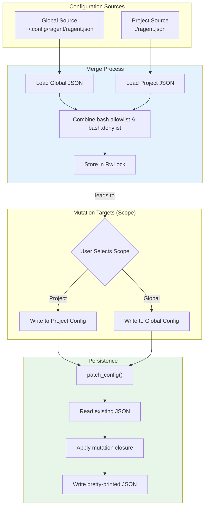

# Configuration Merging and Scope

### From: bash_lists

Configuration merging is the practice of combining settings from multiple sources to produce an effective configuration, with later sources typically overriding earlier ones. The bash_lists module implements a two-level merge: global user settings from `~/.config/ragent/ragent.json` and project settings from `./ragent.json`. The merge happens at startup in `load_from_config()`, with project settings taking precedence for overlapping keys (though for lists, this typically means concatenation rather than replacement). This pattern supports layered configuration where organizations define baseline policies, teams customize for project needs, and individuals maintain personal preferences—all coexisting without conflict.

The Scope concept extends this merging with explicit mutation targets, solving the problem of where to persist runtime changes. When a user runs `/bash add curl`, the system must decide whether to write to the project config (shared with team) or global config (personal). Making this explicit via the Scope parameter prevents accidental pollution of shared configuration and supports intentional policy hierarchies. The implementation uses JSON as a lowest-common-denominator format, manipulated through serde_json's Value type for dynamic structure modification. The `patch_config` function demonstrates robust file I/O: atomic read-modify-write cycles, directory creation, pretty-printed output for version control diffability, and comprehensive error context. This careful attention to configuration durability ensures that security policies survive process restarts and are recoverable from filesystem backups.

## Diagram

## External Resources

- [The Twelve-Factor App - configuration methodology](https://12factor.net/config) - The Twelve-Factor App - configuration methodology
- [Serde - the serialization framework used for JSON manipulation](https://serde.rs/) - Serde - the serialization framework used for JSON manipulation

## Related

- [Runtime Security Policy Management](runtime-security-policy-management.md)

## Sources

- [bash_lists](../sources/bash-lists.md)
