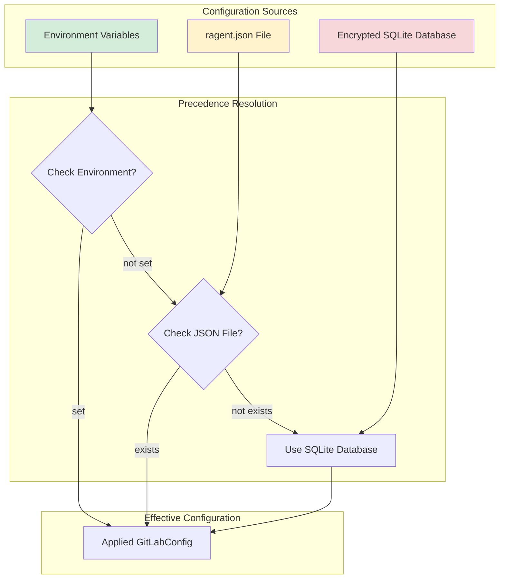

# Configuration Precedence and Override

### From: mod

Configuration precedence and override is a fundamental concept in application configuration management that defines how settings from multiple sources are resolved when conflicts occur, establishing a hierarchy where certain sources take priority over others. This pattern is essential for creating flexible applications that can adapt to different deployment contexts—from developer workstations to production servers—without requiring code changes. The ragent GitLab module explicitly supports this concept through its documented support for credentials stored in encrypted SQLite, with the ability to override these via `ragent.json` configuration files or environment variables. This three-tier hierarchy typically follows the convention that environment variables (most volatile, deployment-specific) override file-based configuration (persistent user preferences), which in turn overrides database defaults (secure system-managed settings). This approach serves multiple use cases: developers can use persistent stored credentials for daily workflows, CI/CD pipelines can inject short-lived tokens through environment variables, and migration paths allow gradual adoption without disrupting existing setups. The explicit acknowledgment of legacy file migration in the API (`migrate_legacy_files`) further demonstrates awareness of configuration evolution, ensuring users can upgrade smoothly while maintaining access to historical settings. Proper implementation of configuration precedence requires careful documentation and predictable behavior, as users depend on understanding where their effective settings originate when debugging authentication or connectivity issues.

## Diagram

## External Resources

- [The Twelve-Factor App: Config principle](https://12factor.net/config) - The Twelve-Factor App: Config principle
- [Command Line Interface Guidelines - Configuration](https://clig.dev/#configuration) - Command Line Interface Guidelines - Configuration

## Related

- [Encrypted Credential Storage](encrypted-credential-storage.md)

## Sources

- [mod](../sources/mod.md)
