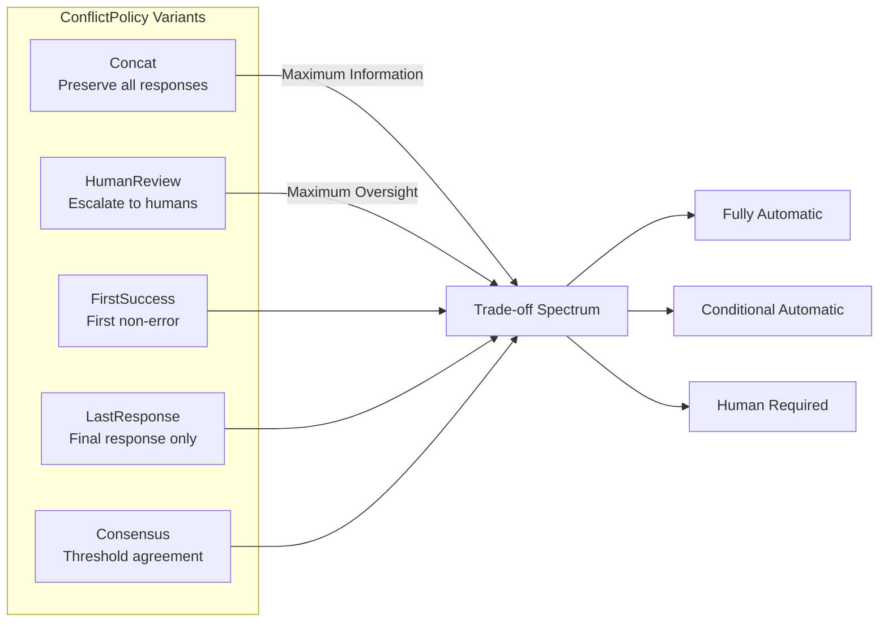

# Conflict Resolution Policies

### From: policy

Conflict resolution policies represent formalized strategies for consolidating divergent outputs from multiple autonomous agents into coherent, actionable results. In distributed multi-agent systems, heterogeneity in agent implementations, training data, or reasoning approaches inevitably produces varied responses to identical inputs. The policy framework codifies organizational or technical preferences for handling this diversity, trading off between comprehensiveness, efficiency, reliability, and oversight requirements. Each policy embodies specific assumptions about the relative value of agent outputs and the acceptable costs of resolution failures, making policy selection a critical configuration decision in system deployment.

The Concat policy represents the most inclusive approach, preserving all agent perspectives by concatenating responses with clear provenance attribution. This strategy maximizes information retention and supports downstream analysis of agent behavior patterns, but may overwhelm consumers with verbose outputs and fails to surface genuine disagreements that warrant attention. It serves as the default and minimum viable product behavior, ensuring system functionality while providing a foundation for understanding typical agent response distributions. The FirstSuccess and LastResponse policies offer streamlined alternatives that prioritize particular agents based on ordering semantics, with FirstSuccess additionally incorporating error detection heuristics that recognize conventional error prefixing patterns.

The Consensus policy introduces sophisticated agreement detection through prefix-based clustering, recognizing that agents may produce semantically equivalent outputs with superficial variations. By comparing the first 64 trimmed characters of responses and requiring configurable threshold agreement, it approximates semantic consensus without expensive natural language understanding infrastructure. This approach acknowledges practical constraints in production environments while providing meaningful automatic resolution for common cases of convergent reasoning. The HumanReview policy completes the spectrum by explicitly acknowledging automatic resolution limitations, delegating to configurable human fallback handlers that can implement organization-specific escalation workflows. Together, these policies form a graduated response framework that balances automation with appropriate human oversight.

## Diagram

## External Resources

- [Wikipedia article on consensus decision-making principles](https://en.wikipedia.org/wiki/Consensus_decision-making) - Wikipedia article on consensus decision-making principles
- [Error handling patterns in Rust applications](https://docs.rs/anyhow/latest/anyhow/) - Error handling patterns in Rust applications

## Related

- [Multi-Agent Coordination](multi-agent-coordination.md)

## Sources

- [policy](../sources/policy.md)
