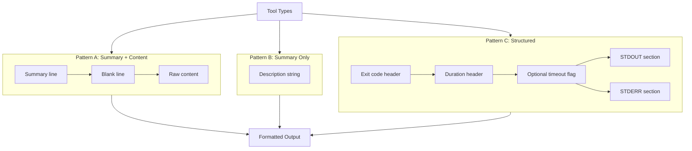

# Content Format Patterns

### From: format

The `format.rs` module implements a formalized system of three content format patterns designed to standardize tool output presentation across the ragent ecosystem. Pattern A, implemented by `format_summary_content`, combines a brief summary line with raw content separated by a blank line—ideal for search results or data retrieval tools where context matters. Pattern B, via `format_simple_summary`, provides minimal summary-only output for file modification operations like writes and edits. Pattern C, implemented in `format_status_output`, delivers structured execution metadata including exit codes, timing information, and separated stdout/stderr streams.

These patterns emerge from practical requirements in agent-based systems where tools must communicate results both to human users and programmatic consumers. The structured Pattern C format enables parsing by downstream automation while remaining human-readable. The module's documentation explicitly references a "tool output consistency plan," indicating these patterns result from deliberate design rather than organic growth. This standardization reduces cognitive load when switching between tools and enables generic output processing utilities.

The pattern system demonstrates how formatting conventions can serve as implicit API contracts. Tools following these patterns integrate seamlessly with common display handlers and logging systems. The implementation details—such as Pattern A's conditional behavior that omits the blank line when content is empty—show careful attention to edge cases that could produce awkward output. Similarly, Pattern C's optional timeout annotation and conditional section inclusion (only showing STDOUT/STDERR headers when content exists) prevent visual clutter while preserving information density.

## Diagram

## External Resources

- [Unix philosophy on tool composition and output conventions](https://en.wikipedia.org/wiki/Unix_philosophy) - Unix philosophy on tool composition and output conventions

## Related

- [Pluralization Logic](pluralization-logic.md)
- [Human-Readable Formatting](human-readable-formatting.md)

## Sources

- [format](../sources/format.md)
