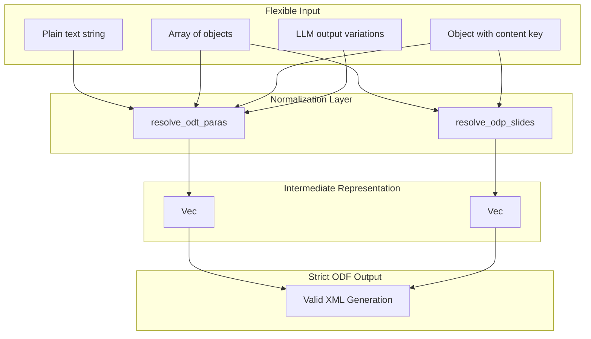

# Content Normalization and Intermediate Representation

### From: libreoffice_write

A sophisticated architectural pattern in libreoffice_write.rs is the use of intermediate representations (IR) to bridge the gap between flexible JSON input and strict ODF output requirements. The codebase implements this pattern twice: `OdtPara` for text documents and `OdpSlide` for presentations. This approach solves a fundamental problem in document generation systems: input sources (particularly LLM outputs) produce highly variable structures, while output formats demand precise, valid markup. The normalization process in `resolve_odt_paras` exemplifies this flexibility, accepting plain strings, arrays of objects, or objects with nested content keys. The function applies a series of heuristics to interpret ambiguous input: checking for `type` fields to identify structured elements, falling back to alternative keys like `heading` when `text` is absent, and clamping numeric values to valid ranges. The resulting `OdtPara` instances carry a normalized `style` enum that eliminates string-based ambiguity, converting variations like "Heading1", "heading_1", and "heading 1" into a typed `OdtStyle::Heading(1)`. This enum-based approach provides compile-time exhaustiveness checking in the XML generation phase, preventing invalid style references. The pattern demonstrates defensive programming for LLM integration, where the system must gracefully handle semantically equivalent but syntactically diverse outputs. The separation of concerns—parsing/normalization in the resolve functions, XML generation in the content_structured functions—enables independent evolution of input handling and output formatting, supporting new input formats without modifying serialization logic.

## Diagram

## External Resources

- [Intermediate representation in compiler design](https://en.wikipedia.org/wiki/Intermediate_representation) - Intermediate representation in compiler design
- [Rust API Guidelines: Type Safety](https://rust-lang.github.io/api-guidelines/type-safety.html) - Rust API Guidelines: Type Safety

## Related

- [Defensive Programming](defensive-programming.md)

## Sources

- [libreoffice_write](../sources/libreoffice-write.md)
