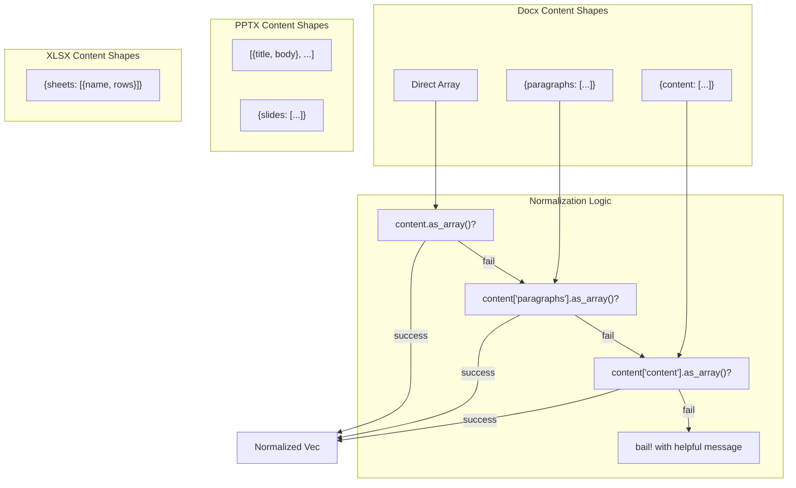

# Content Shape Normalization

### From: office_write

Content shape normalization is a critical software engineering pattern employed throughout the OfficeWriteTool implementation to handle the inherent unpredictability of LLM-generated structured data. Large language models, despite precise instructions, often produce JSON outputs with varying structures—sometimes placing arrays at the top level, sometimes nesting them under specific keys, and occasionally using alternative key names for equivalent data. The tool implements multiple layers of normalization to accommodate these variations. For Word documents, it accepts content as a direct array, an object with a `paragraphs` array, or an object with a `content` array. For Excel files, it looks for a `sheets` array at various nesting levels. For PowerPoint, it handles both direct slide arrays and objects containing a `slides` key. This pattern is implemented through a cascade of `if let` statements using Serde's `Value` type, attempting each expected shape in order of preference. The normalization extends to individual elements within arrays, where the code checks for multiple possible field names—such as accepting both `text` and `heading` for heading content, or inferring heading level from either a `level` field or a `style` field containing "HeadingN". This robust approach ensures that the tool remains functional across different LLM providers and model versions, each with their own tendencies for JSON structuring.

## Diagram

## External Resources

- [Serde Value type for dynamic JSON handling](https://serde.rs/value.html) - Serde Value type for dynamic JSON handling
- [serde_json::Value API documentation](https://docs.rs/serde_json/latest/serde_json/value/enum.Value.html) - serde_json::Value API documentation

## Related

- [Defensive Programming](defensive-programming.md)

## Sources

- [office_write](../sources/office-write.md)
