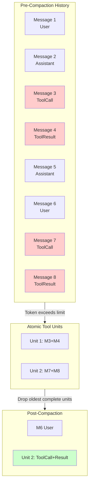

# Context Window Management

### From: processor

Context window management addresses the fundamental constraint that language models process finite token sequences, requiring careful curation of what information occupies limited context space. The `SessionProcessor` implements this through `compact_history_with_atomic_tool_calls`, which reduces message history while preserving the structural integrity of tool call and result pairs. This atomicity constraint recognizes that partial tool call sequences—where the call appears without its result or vice versa—create nonsensical training-like data that degrades model behavior.

The compaction strategy likely employs token estimation heuristics to approximate when truncation becomes necessary, prioritizing recent messages while maintaining complete tool exchange units. This differs from naive truncation that might split tool calls mid-sequence. The `context_window` and `max_output_tokens` parameters suggest a reservation-based approach where output generation capacity is subtracted from available context, preventing overallocation that would truncate the model's own generation space.

The implementation's integration with `history_to_chat_messages` indicates a two-phase pipeline: first compaction of the internal `Message` representation, then transformation to the `ChatMessage` format expected by LLM providers. This separation allows provider-agnostic optimization before format-specific serialization. The atomic guarantee has operational significance for debugging and reproducibility—users can inspect session history and observe complete reasoning chains without orphaned tool references that would confuse manual analysis.

## Diagram

## External Resources

- [Lost in the Middle: How Language Models Use Long Contexts](https://arxiv.org/abs/2309.03883) - Lost in the Middle: How Language Models Use Long Contexts
- [OpenAI tokenizer for context estimation](https://platform.openai.com/tokenizer) - OpenAI tokenizer for context estimation

## Sources

- [processor](../sources/processor.md)

### From: team_spawn

Context window management emerges as a critical operational concern throughout the `TeamSpawnTool` implementation, directly motivating the architectural constraint that each teammate receive exactly one bounded work item rather than enumerated lists. This concept addresses the finite attention capacity of large language models—typically measured in tokens—where exceeding optimal context density degrades retrieval accuracy, reasoning quality, and task completion rates. The implementation's aggressive detection of multi-item patterns (requiring 3+ enumerated elements) with user-facing warnings reflects empirical understanding that context overflow represents a primary failure mode in multi-agent deployments, not merely a theoretical limitation.

The `detect_multi_item_list` function implements heuristic pattern matching specifically designed to distinguish genuine structural lists from incidental connective language. The historical note in comments—"Single connectives like 'and' / 'or' in prose do **not** trigger detection — those caused rampant false positives previously"—reveals iterative refinement based on production experience. This evolution from simpler detection toward structural analysis (line-start patterns with digit/letter enumeration or bullet markers) demonstrates applied machine learning operations (MLOps) practices where deployment feedback shapes tooling behavior. The threshold of three items rather than two suggests calibration against observed failure modes, potentially reflecting the finding that dual-item prompts remain tractable while triple-item prompts exhibit significantly degraded performance.

Beyond reactive detection, the implementation includes proactive guidance through parameter documentation and error messaging. The prompt parameter description explicitly mandates "SINGLE work item" specification with word count limits (~500 words) and file reference patterns rather than content inclusion—representing prescriptive best practices for context efficiency. These constraints propagate through the entire workflow: model inheritance defaults, memory scope configuration for cross-session context management, and the eventual `team_wait` synchronization that presumably aggregates results before context-consuming continuation. Together these patterns constitute a comprehensive context management strategy spanning single-prompt optimization, inter-agent context isolation, and persistent memory architecture for longitudinal collaboration.
