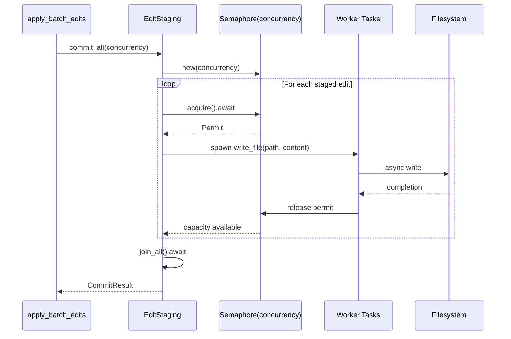

# Controlled Concurrent I/O

### From: api

Controlled concurrent I/O is a resource management strategy that exploits parallelism for performance while preventing resource exhaustion through explicit concurrency limits. In file operations, this addresses the fundamental tension that while storage devices and operating systems can handle multiple simultaneous operations, unbounded concurrency degrades performance through context switching, cache thrashing, and handle exhaustion, and can cause outright failures. The `concurrency: usize` parameter in `commit_all` embodies this balanced approach.

The implementation of controlled concurrency in async Rust typically leverages semaphore-based patterns or specialized concurrent stream processing. A semaphore initialized with the concurrency limit acts as a guard: each commit task acquires a permit before starting, and releases it upon completion. This naturally bounds the number of in-flight operations without requiring complex manual coordination. The async runtime (typically Tokio in this ecosystem) efficiently manages the waiting tasks, resuming them as permits become available. This pattern provides backpressure: if commits slow down due to I/O contention, new tasks simply wait rather than exacerbating the problem.

Selecting an appropriate concurrency limit involves understanding workload characteristics and deployment environment. For local SSD storage, higher concurrency (potentially dozens of operations) may be optimal due to low latency and high queue depth tolerance. For network filesystems or spinning disks, lower limits prevent seek thrashing and timeout issues. The parameterization of this limit in the API allows tuning without code changes, enabling different defaults for different deployment contexts or dynamic adjustment based on system load. This flexibility is crucial for library code that cannot predict its execution environment.

Error handling in concurrent I/O presents unique challenges that controlled concurrency helps address. When one of many parallel tasks fails, the system must decide whether to abort in-flight operations, wait for completion, or attempt partial cleanup. The structured concurrency patterns enabled by async Rust's JoinSet or similar abstractions, combined with explicit concurrency limits, make these decisions tractable. The `Result<CommitResult>` return type suggests that `commit_all` handles these complexities internally, propagating a unified result that aggregates individual operation outcomes. This abstraction frees callers from implementing complex concurrent error handling while still providing visibility into what occurred.

## Diagram

## External Resources

- [Tokio semaphore for limiting concurrency](https://tokio.rs/tokio/tutorial/semaphore) - Tokio semaphore for limiting concurrency
- [Futures stream concurrency control](https://docs.rs/futures/latest/futures/stream/fn.iter.html) - Futures stream concurrency control
- [I/O concurrency benchmarking and best practices](https://www.infoq.com/articles/io-threading-benchmark/) - I/O concurrency benchmarking and best practices

## Related

- [Batch File Operations with Staging](batch-file-operations-with-staging.md)

## Sources

- [api](../sources/api.md)
