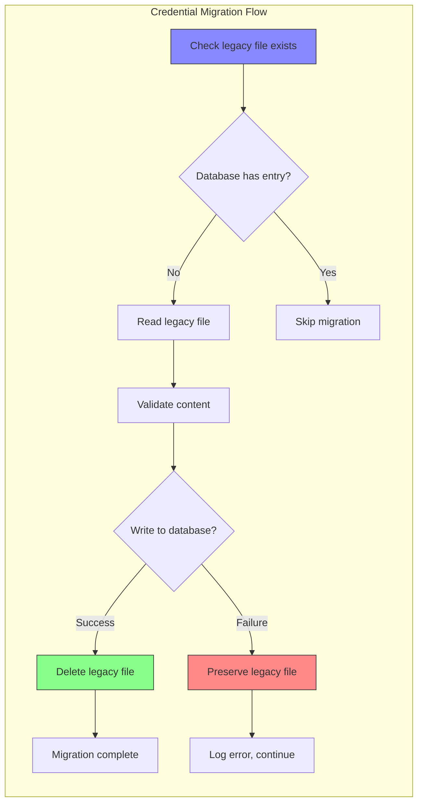

# Credential Migration Patterns

### From: auth

Credential migration patterns address the challenge of evolving storage mechanisms while maintaining application functionality and user experience. The ragent module implements an opportunistic migration strategy, detecting legacy file-based credentials and transparently upgrading them to encrypted database storage without user intervention. This approach, implemented in `migrate_legacy_files`, exemplifies several migration pattern best practices: idempotency (safe to run multiple times), atomic validation (verify database write succeeds before deleting source), and graceful degradation (continue operating if migration fails).

The pattern addresses real-world constraints in long-running applications where breaking changes to credential storage would otherwise force manual user reconfiguration. By preserving the legacy file paths in separate functions (`legacy_token_file_path`, `legacy_config_file_path`), the code maintains clear separation between current and deprecated storage locations. The migration's dependency on `dirs::home_dir()` for cross-platform home directory resolution ensures consistent behavior across Windows, macOS, and Linux environments—critical for developer tools with heterogeneous user bases.

This migration pattern illustrates technical debt management in security-sensitive code. The explicit `TODO`-like comments and section headers (`// --------------------------------------------------------------------------- // Migration: file-based storage → database // ---------------------------------------------------------------------------`) document intentional transitional code that may be removed in future versions. The pattern's limitation—migrating only when database entries are absent—prevents overwriting newer credentials but may leave stale files if users manually reconfigure after initial migration. Production-hardened implementations might include timestamp-based conflict resolution or backup creation before deletion.

## Diagram

## External Resources

- [Evolutionary Database Design by Martin Fowler](https://martinfowler.com/articles/evodb.html) - Evolutionary Database Design by Martin Fowler
- [dirs-rs - Rust library for platform-specific directories](https://dirs.dev/) - dirs-rs - Rust library for platform-specific directories

## Sources

- [auth](../sources/auth.md)
