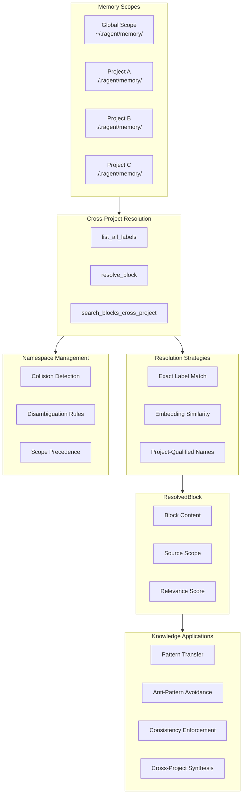

# Cross-Project Memory Resolution

### From: mod

Cross-project memory resolution addresses the challenge of knowledge fragmentation in agent systems that operate across multiple codebases or organizational contexts. Software developers routinely work with numerous projects—personal repositories, client codebases, open source contributions, and internal libraries—each accumulating distinct but often related knowledge. Without explicit support for cross-project resolution, agents treat each project's memory as isolated, missing opportunities to apply lessons learned elsewhere and forcing redundant learning of common patterns. This siloing undermines the efficiency gains that persistent memory promises, as expertise cannot compound across an agent's full operational history.

The ragent `cross_project` module implements unified memory access through functions like `list_all_labels`, `resolve_block`, and `search_blocks_cross_project`. These capabilities enable agents to query memory across scope boundaries, finding relevant patterns from global memory when project-local knowledge is insufficient, and identifying project-specific adaptations of general principles. The `ResolvedBlock` type encapsulates resolution results with provenance information, enabling agents to understand knowledge source context when deciding applicability. This is crucial because patterns appropriate in one context may be anti-patterns in another—cross-project resolution must surface candidates while preserving the discrimination capability to reject inappropriate transfers.

The technical implementation requires careful namespace management. Memory blocks use `BlockScope` to declare project or global residency, with resolution logic traversing scope hierarchies according to configurable precedence rules. Label collisions across projects must be disambiguated, potentially through project-prefixed qualified names or through similarity-based matching when explicit references are ambiguous. The `search_blocks_cross_project` function likely implements embedding-based similarity search across scope boundaries, finding conceptually related memories regardless of their original project context. This semantic matching is essential because terminology varies across codebases—a "controller" in one web framework may correspond to a "handler" or "resource" in others.

Cross-project resolution enables several valuable agent behaviors. Pattern transfer allows agents to recognize that a logging approach successful in Project A applies to similar situations in Project B, even with different languages or frameworks. Anti-pattern avoidance helps agents recognize that a technique caused problems elsewhere, prompting caution before adoption. Consistency enforcement supports organizational standards by making global best practices visible during project-local development. Knowledge synthesis enables agents to identify abstractions that emerge from comparing similar implementations across projects, potentially suggesting library extraction or shared tooling. These capabilities transform agents from project-specific assistants into organizational knowledge carriers, accumulating and distributing expertise across the boundaries that fragment human organizational memory.

## Diagram

## External Resources

- [Transfer learning in educational psychology](https://en.wikipedia.org/wiki/Transfer_of_learning) - Transfer learning in educational psychology
- [Pattern: Extract Shared Library - cross-project abstraction](https://martinfowler.com/articles/extract-shared-library.html) - Pattern: Extract Shared Library - cross-project abstraction

## Sources

- [mod](../sources/mod.md)
