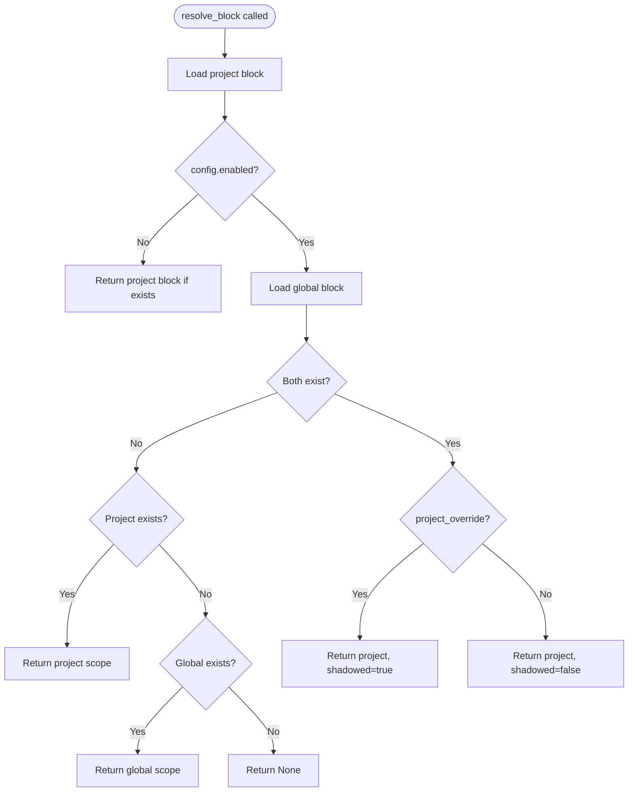

# Cross-Project Memory Scope Resolution

### From: cross_project

Cross-project memory scope resolution is a domain-specific algorithmic concept that determines which version of a named memory block should be active when multiple scopes contain blocks with the same label. In Ragent's implementation, this involves a three-way decision between project-scoped blocks, global-scoped blocks, and configurable override behavior. The resolution algorithm prioritizes the most specific scope (project) over the more general scope (global), but this can be modified through the `project_override` configuration flag. When override is enabled and both scopes contain matching blocks, the project block "shadows" the global block, with this relationship explicitly tracked in the `ResolvedBlock` metadata.

This concept parallels scope resolution mechanisms found in programming language design, particularly in module systems and inheritance hierarchies. Like Python's LEGB rule (Local, Enclosing, Global, Built-in) or CSS specificity calculations, Ragent's memory resolution provides predictable, deterministic behavior for name collisions. The shadowing semantics allow projects to customize global templates without destroying the original, enabling a form of memory inheritance. The algorithm's implementation uses Rust's pattern matching for exhaustive case analysis, ensuring all combinations of existence and configuration are handled. The complexity of proper scope resolution is often underestimated in system design; Ragent's explicit `ResolvedBlock` type with `winning_scope` and `shadowed` fields provides transparency that aids debugging and auditability in agent workflows.

## Diagram

## External Resources

- [Variable shadowing in programming languages](https://en.wikipedia.org/wiki/Variable_shadowing) - Variable shadowing in programming languages
- [Rust pattern matching for exhaustive case handling](https://doc.rust-lang.org/rust-by-example/flow_control/match.html) - Rust pattern matching for exhaustive case handling

## Related

- [Memory Block Shadowing](memory-block-shadowing.md)
- [Trait-Based Storage Abstraction](trait-based-storage-abstraction.md)

## Sources

- [cross_project](../sources/cross-project.md)
