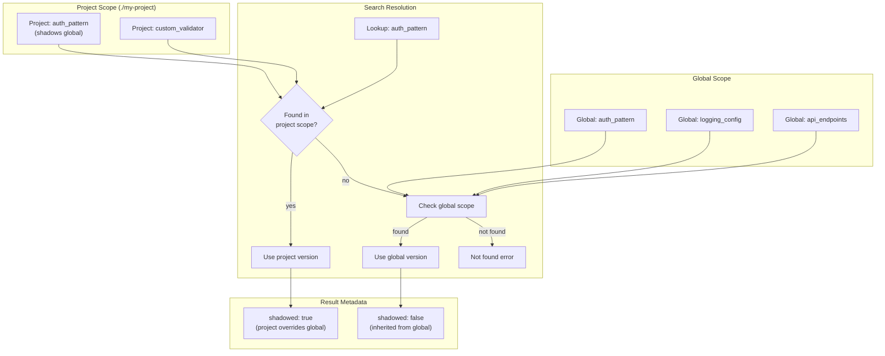

# Cross-Project Memory Scoping

### From: memory_search

Cross-project memory scoping addresses a fundamental challenge in AI assistant deployment: how to share knowledge across organizational boundaries while respecting context specificity. MemorySearchTool implements a layered namespace system where memory blocks can be defined at global scope (visible everywhere) or project scope (specific to a working directory), with project definitions shadowing globals when identifiers conflict. This design enables pattern libraries, corporate standards, and common utilities to be defined once and specialized per-project without code duplication.

The scoping semantics mirror established programming language module systems. Like Python's import resolution or CSS's cascade, the system defines deterministic lookup rules: search project scope first, fall back to global scope if not found, with explicit shadowing indicators in results. The shadowed flag in search results informs users when they're seeing a project-specific override rather than the global default—critical for debugging unexpected behavior. The implementation through CrossProjectConfig allows runtime reconfiguration without code changes, supporting varied deployment models from single-user desktops to multi-tenant cloud services.

Practical applications include enterprise AI deployments where each team maintains project-specific conventions atop organizational standards. A global memory might define the company's API authentication pattern, while a project memory overrides it with test credentials or a legacy variant. The file-based storage of memory blocks (via FileBlockStorage) facilitates this workflow: global blocks live in a shared directory under version control, project blocks in repository-local .memory directories. This architecture also enables memory marketplace concepts—curated global block collections that teams can opt into—while project scoping ensures customization doesn't require forking. The search_blocks_cross_project function encapsulates these resolution rules, keeping MemorySearchTool's core logic focused on result presentation rather than scope arithmetic.

## Diagram

## External Resources

- [Variable shadowing concept in programming languages](https://en.wikipedia.org/wiki/Variable_shadowing) - Variable shadowing concept in programming languages
- [12-Factor App methodology for configuration management](https://12factor.net/config) - 12-Factor App methodology for configuration management
- [Testing strategies in microservices with shared and specific components](https://martinfowler.com/articles/microservice-testing/) - Testing strategies in microservices with shared and specific components

## Sources

- [memory_search](../sources/memory-search.md)
