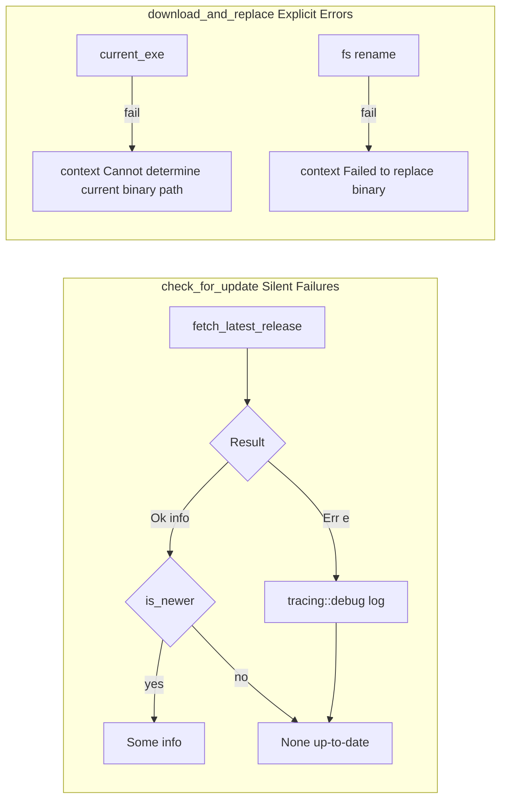

# Defensive Error Handling in Update Systems

### From: mod

Defensive error handling in update systems prioritizes application stability and user experience over update success, recognizing that update functionality is typically non-critical to core application operation. The ragent updater exemplifies this philosophy through multiple design decisions: update check failures are logged at debug level rather than propagated to users, network timeouts prevent indefinite hanging on poor connections, and the `Option<ReleaseInfo>` return type allows silent failure by returning `None` for any error condition. This approach acknowledges that update infrastructure may be temporarily unavailable, that users may be offline, and that API rate limits or authentication issues should not degrade the primary application experience. The implementation uses Rust's `Result` type internally for explicit error propagation during the update check process, but converts failures to `None` at the public API boundary. For the download-and-replace operation, which is explicitly invoked rather than automatic, errors are preserved and propagated since the user has indicated intent to update. This layered error handling strategy balances operational transparency with resilience.

## Diagram

## External Resources

- [Anyhow crate for ergonomic error handling in Rust applications](https://docs.rs/anyhow/latest/anyhow/) - Anyhow crate for ergonomic error handling in Rust applications
- [Asynchronous programming in Rust book](https://rust-lang.github.io/async-book/03_async_await/01_chapter.html) - Asynchronous programming in Rust book

## Sources

- [mod](../sources/mod.md)
