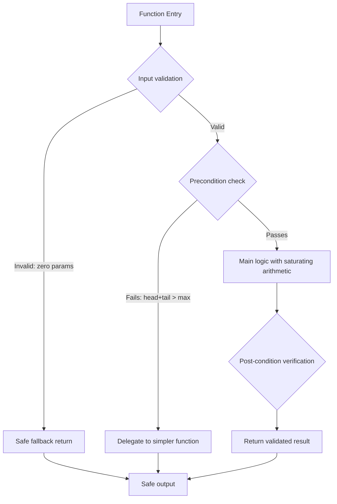

# Defensive Programming in Text Utilities

### From: truncate

Defensive programming in text utilities encompasses the systematic anticipation and graceful handling of edge cases that might otherwise cause crashes, infinite loops, or nonsensical output. The truncate.rs module demonstrates this philosophy through multiple defensive layers: explicit handling of `max_lines == 0` to prevent underflow in `saturating_sub` operations, validation that `head_lines + tail_lines` doesn't exceed `max_lines` before attempting the head-tail truncation strategy, and fallback delegation to simpler functions when preconditions aren't met. The consistent use of `saturating_sub` throughout arithmetic operations prevents panic conditions that could arise with standard subtraction on `usize` values when logic errors occur. The `impl AsRef<str>` generic parameter provides type flexibility while preventing null pointer scenarios possible in languages with nullable string types. Test coverage validates these defenses with explicit cases for empty strings, zero limits, and boundary conditions like single-line omissions. This defensive approach reflects lessons learned from decades of text processing bugs in production systems, where assumptions about input validity routinely prove false when processing user-generated content, malformed tool output, or unexpected encoding scenarios. The pattern aligns with Rust's ownership and error handling philosophy, where many potential failures are prevented at compile time, and remaining runtime concerns are addressed through careful validation rather than exception catching.

## Diagram

## External Resources

- [Rust saturating_sub documentation for safe arithmetic operations](https://doc.rust-lang.org/std/primitive.usize.html#method.saturating_sub) - Rust saturating_sub documentation for safe arithmetic operations
- [Defensive programming principles in software engineering](https://en.wikipedia.org/wiki/Defensive_programming) - Defensive programming principles in software engineering
- [Rust by Example unit testing guide showing edge case coverage](https://doc.rust-lang.org/rust-by-example/testing/unit_testing.html) - Rust by Example unit testing guide showing edge case coverage

## Sources

- [truncate](../sources/truncate.md)
