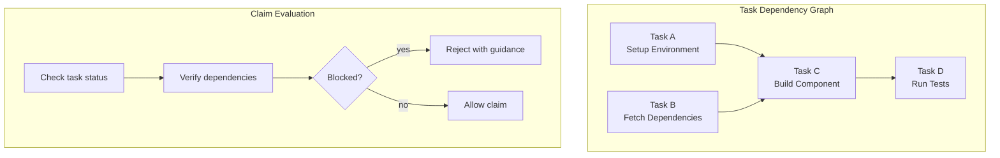

# Dependency-Aware Task Scheduling

### From: team_task_claim

Dependency-aware task scheduling is a workflow management pattern where task eligibility for execution depends on the completion state of prerequisite tasks, creating a partial order of work that must be respected for correct results. The TeamTaskClaimTool implementation enforces these constraints at claim time, preventing agents from beginning work whose inputs remain unavailable. This eager validation catches dependency violations before work investment, unlike lazy validation that might permit claim only to block during execution.

The pattern manifests in two distinct scenarios within the tool. For opportunistic claims (claim_next), the scheduler implicitly filters to tasks with empty or fully-satisfied depends_on sets, automatically skipping tasks whose prerequisites are pending or failed. For directed claims (claim_specific), the scheduler validates the requested task's dependencies and returns explicit error guidance when prerequisites block execution. This dual behavior supports both autonomous agent operation and coordinated team workflows where leads assign critical path items with awareness of dependency chains.

The implementation's approach to dependency failure reflects user experience considerations for agent systems. Rather than opaque errors, the tool detects dependency-specific failures and injects contextual guidance into responses, directing agents toward appropriate waiting behavior. The metadata flag blocked_by_dependencies enables programmatic handling, allowing orchestrators to implement dependency-notification patterns where agents subscribe to completion events rather than polling. This foundation supports sophisticated patterns like critical path optimization, where tasks on the longest dependency chain receive priority, and dynamic replanning, where dependency failures trigger alternative task activation.

## Diagram

## External Resources

- [Directed acyclic graphs for dependency modeling](https://en.wikipedia.org/wiki/Directed_acyclic_graph) - Directed acyclic graphs for dependency modeling
- [Critical path method for project scheduling](https://en.wikipedia.org/wiki/Critical_path_method) - Critical path method for project scheduling

## Related

- [Atomic Task Claiming](atomic-task-claiming.md)

## Sources

- [team_task_claim](../sources/team-task-claim.md)
