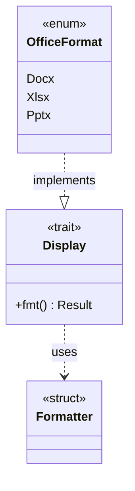

# Display Trait for Enum String Representation

### From: office_common

The implementation of `std::fmt::Display` for the `OfficeFormat` enum demonstrates a common Rust pattern for providing human-readable string representations of enum variants. In Rust, the `Display` trait is used for user-facing formatting, distinct from `Debug` (for programmer-facing output) and `ToString` (which is automatically implemented for types implementing `Display`). The implementation maps each enum variant to its lowercase file extension string: `Docx` to "docx", `Xlsx` to "xlsx`, and `Pptx` to "pptx". This choice aligns the Display representation with the canonical file extensions, creating a natural correspondence between the type system and the external representation. The use of the `write!` macro with the formatter pattern is the idiomatic approach, properly propagating formatting errors and respecting formatting specifications.

This pattern serves multiple purposes in the codebase. It enables ergonomic string conversion through standard mechanisms like `format!("{}", format)` or `.to_string()`, ensuring consistent representation across logging, error messages, and user interfaces. The lowercase representation matches the normalized extensions used in format detection, creating symmetry between parsing and serialization. By implementing `Display` rather than providing a custom method, the enum integrates seamlessly with Rust's formatting ecosystem, working with `println!`, `write!` to files, and other standard library facilities. The implementation is deliberately simple, containing no additional formatting options or complexity, reflecting the principle that `Display` should provide the most common, expected representation.

The `Display` trait occupies an important position in Rust's trait hierarchy for string conversion. It is more flexible than `ToString` (which it enables), more appropriate for user output than `Debug`, and more standardized than custom methods. This pattern of implementing `Display` for enums representing domain concepts appears throughout Rust codebases, from representing HTTP status codes to days of the week. The specific choice of lowercase output for file formats follows widespread conventions where extensions are case-insensitive but typically presented in lowercase. The implementation also demonstrates Rust's exhaustive pattern matching, with each variant explicitly handled, ensuring that adding a new format variant will trigger compiler warnings until `Display` is updated, maintaining consistency across the codebase.

## Diagram

## External Resources

- [Rust Display trait documentation](https://doc.rust-lang.org/std/fmt/trait.Display.html) - Rust Display trait documentation
- [Rust formatting system overview](https://doc.rust-lang.org/std/fmt/) - Rust formatting system overview

## Related

- [File Format Detection by Extension](file-format-detection-by-extension.md)

## Sources

- [office_common](../sources/office-common.md)
