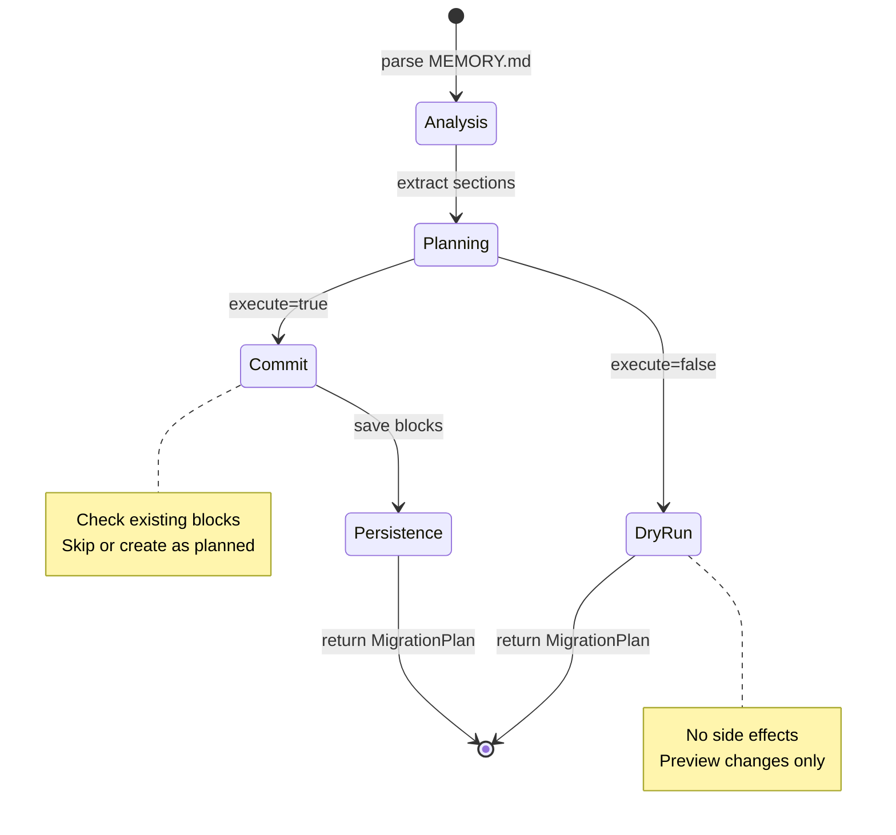

# Dry-Run Migration Pattern

### From: migrate

The Dry-Run Migration Pattern is a software design principle that separates the analysis and planning phase of data migrations from their execution phase, enabling safe preview and validation of changes before any destructive or permanent operations occur. This pattern is implemented explicitly in the migrate_memory_md function through its `execute` boolean parameter, where `false` performs complete analysis without side effects and `true` commits the planned changes. This design provides multiple critical benefits for production data systems: risk mitigation through preview, opportunity for human review, support for automated validation, and graceful error handling before commit points.

The implementation in this module demonstrates several characteristics of mature dry-run pattern applications. The MigrationPlan struct serves as a rich intermediate representation capturing not just what would change, but detailed metadata about why and how. Each planned operation includes the source content, computed statistics, and conflict status, enabling sophisticated analysis beyond simple change lists. The pattern maintains consistency: the same code paths perform analysis in both modes, with only the final persistence operations gated by the execution flag. This ensures that what users preview is what they get, avoiding the common anti-pattern where dry-run logic diverges from actual execution logic.

Safety mechanisms in this implementation illustrate how dry-run patterns interact with conflict detection. The storage system's check for existing blocks during analysis populates `would_skip`, preventing accidental overwrites. This information is available in dry-run mode for user review, allowing informed decisions about whether to proceed, modify source content to resolve conflicts, or adjust target configurations. The preservation of source files as backups—even during execution—provides defense in depth beyond the dry-run protection itself.

The dry-run pattern here extends to comprehensive testing strategies. The test suite includes explicit dry-run tests that verify no files are created when `execute` is false, complementing execution tests that verify proper creation when true. This dual-mode testing ensures pattern correctness across both operational states. In broader software architecture, this pattern appears in database migration tools, infrastructure-as-code deployments, and any system where changes have significant consequences and should be previewable before commitment.

## Diagram

## External Resources

- [Dry run testing concept in software engineering](https://en.wikipedia.org/wiki/Dry_run_(testing)) - Dry run testing concept in software engineering
- [Evolutionary database design and migration patterns](https://martinfowler.com/articles/evodb.html) - Evolutionary database design and migration patterns

## Related

- [Markdown Content Migration](markdown-content-migration.md)
- [Defensive Programming](defensive-programming.md)

## Sources

- [migrate](../sources/migrate.md)
