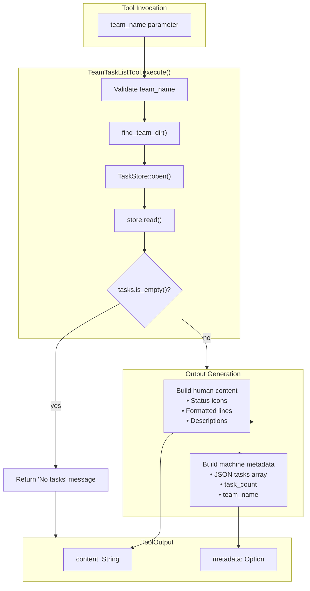

# Dual-Format Output Design

### From: team_task_list

Dual-format output design is a user experience pattern that simultaneously provides human-readable text and machine-parseable structured data from the same operation. The ragent-core ToolOutput struct implements this through separate content and metadata fields, enabling consumption by diverse downstream systems. The content field carries formatted text optimized for human reading—incorporating visual hierarchy, emoji indicators, and natural language—while metadata delivers JSON-structured data for programmatic processing, persistence, or further computation. This approach recognizes that agent systems serve multiple audiences: end-users requiring intuitive presentation, automation pipelines needing reliable data extraction, and diagnostic systems inspecting execution traces.

The TeamTaskListTool exemplifies sophisticated application of this pattern. Its content construction accumulates formatted lines with status icons and dependency annotations for immediate comprehension, while the tasks_json vector builds parallel structured representation with complete field preservation. This redundancy is intentional and valuable: the human format sacrifices data completeness for readability (hiding empty descriptions, abbreviating dependencies), while the machine format ensures no information loss. Agent frameworks leveraging this output can route content to conversation interfaces while using metadata for state updates, analytics, or downstream tool inputs.

Designing effective dual-format outputs requires careful consideration of audience needs and consumption contexts. The human format should prioritize scannability and context establishment—TeamTaskListTool's header "Tasks for team '{team_name}':" orients readers immediately. The machine format should follow established schema conventions and include provenance metadata (team_name repetition, task_count summary) that simplifies client processing. Versioning considerations matter: schema evolution in metadata must maintain backward compatibility or explicit versioning, while content format changes impact prompt engineering for LLM consumers. This pattern appears across modern agent systems, from LangChain's AgentFinish structures to OpenAI's message content variants, reflecting industry consensus on multi-modal output requirements.

## Diagram

## External Resources

- [Designing Web APIs by Brenda Jin, Saurabh Sahni, and Amir Shevat](https://www.oreilly.com/library/view/designing-web-apis/9781492026871/) - Designing Web APIs by Brenda Jin, Saurabh Sahni, and Amir Shevat
- [JSON Schema specification for structured data validation](https://json-schema.org/) - JSON Schema specification for structured data validation

## Sources

- [team_task_list](../sources/team-task-list.md)

### From: aiwiki_search

The dual-format output design pattern addresses a fundamental tension in agent systems: outputs must be human-readable for user presentation yet machine-parseable for downstream processing. This implementation's `ToolOutput` struct elegantly solves this with separate `content` and `metadata` fields. The `content` field contains formatted markdown suitable for immediate display, while `metadata` holds structured JSON that preserves query parameters, result counts, and boolean flags without requiring text parsing.

The pattern manifests in several concrete design decisions. Search results are formatted as numbered markdown lists with bold titles, code-formatted paths, and italic excerpts—optimized for human scanning—while the metadata captures `results_count`, `total_matches`, and `enabled` status as typed values. This separation enables powerful workflows: agents can check `metadata.enabled` to detect system state without regex parsing, logging systems can aggregate `metadata.results_count` without NLP, yet end users see clean formatted output. The empty results case similarly provides both empathetic messaging and structured null-result indication.

This approach contrasts with simpler designs that return only strings (forcing parsing) or only JSON (forcing presentation logic on callers). It enables what might be called "observable agent execution" where every tool call produces auditable artifacts. The metadata inclusion of the original query ensures traceability—critical for debugging agent behavior where tools may be called with LLM-generated parameters that differ from user intent. The optional wrapping with `Some()` suggests the metadata field itself may be omitted in certain output modes, perhaps for size-constrained contexts or when privacy filtering applies.
