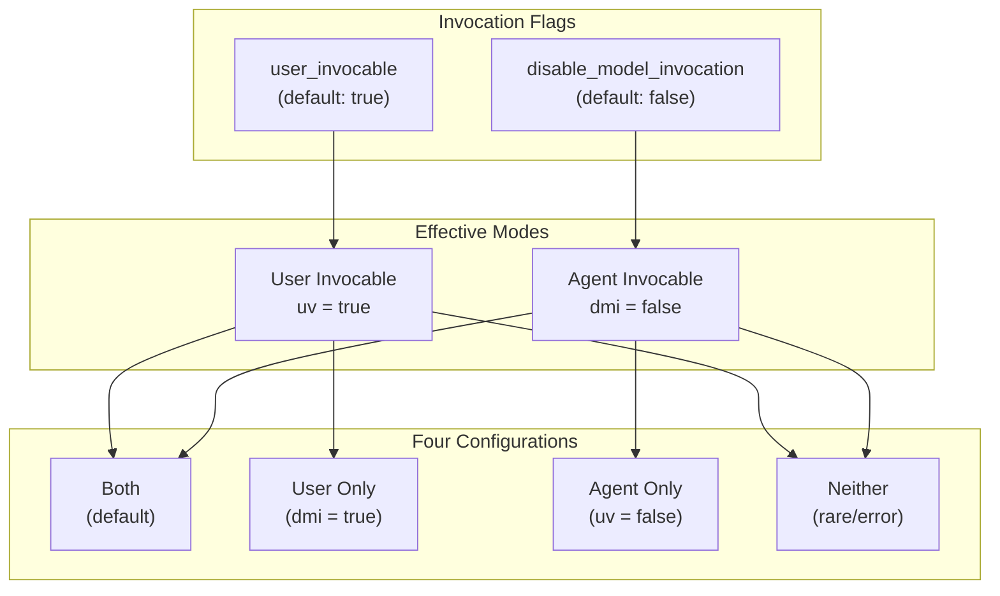

# Dual Invocation Mode System

### From: mod

The dual invocation mode system distinguishes between user-initiated and agent-auto-invoked skill execution, enabling fine-grained control over skill visibility and automation. This design recognizes that different skills serve different purposes: some are tools users explicitly request through commands like /deploy, while others are capabilities the agent should automatically activate when contextually appropriate. The system implements this through two independent boolean flags on SkillInfo: user_invocable and disable_model_invocation.

User invocability controls visibility in command interfaces and manual triggering. When user_invocable is true (the default), skills appear in / autocompletion menus and respond to explicit user commands. When false, skills remain hidden from users, reserved exclusively for agent automatic invocation. This enables "background" capabilities that users benefit from without needing to know about explicitly. The is_user_invocable method provides read access to this flag with const fn efficiency.

Agent invocability, conversely, controls whether the model can automatically trigger skills based on context analysis. The disable_model_invocation flag (default false, meaning auto-invocation is permitted) provides an opt-out for operations requiring human judgment or authorization. The is_agent_invocable method returns the inverse of this flag, presenting a positive capability assertion suitable for filtering and documentation. The combination of these flags creates four valid configurations: fully invocable (default), user-only, agent-only, and restricted (neither, though this likely represents configuration error). The registry's list_user_invocable and list_agent_invocable methods leverage these predicates for filtered views supporting different UI contexts.

## Diagram

## External Resources

- [Principle of least privilege (security design principle)](https://en.wikipedia.org/wiki/Principle_of_least_privilege) - Principle of least privilege (security design principle)

## Related

- [Skill Registry Pattern](skill-registry-pattern.md)

## Sources

- [mod](../sources/mod.md)
