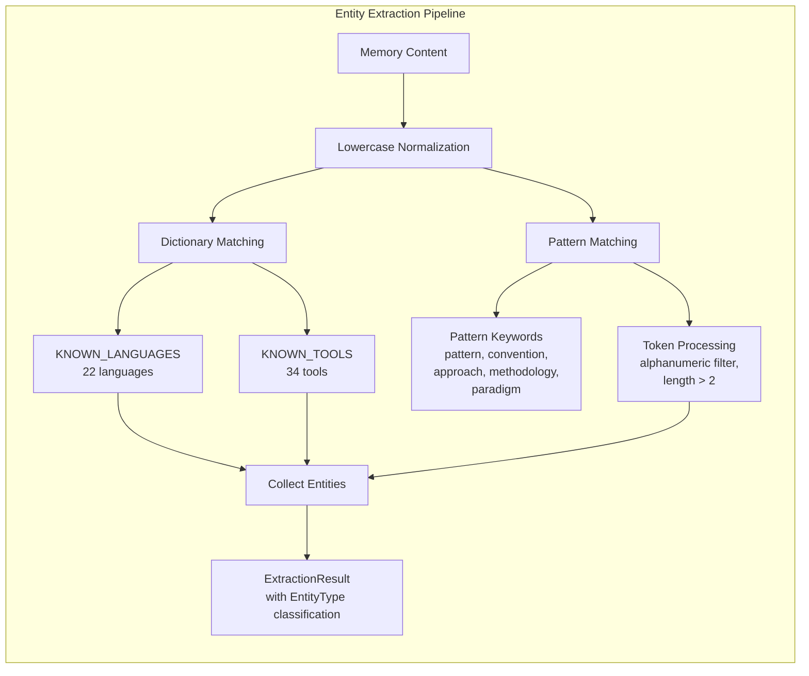

# Entity Extraction

### From: knowledge_graph

Entity extraction in this system operates through a multi-stage pipeline combining dictionary-based matching with pattern-based detection, reflecting pragmatic engineering trade-offs between accuracy and implementation complexity. The primary extraction mechanism iterates through hardcoded lists of KNOWN_LANGUAGES and KNOWN_TOOLS, performing case-insensitive substring matching against normalized content. This approach achieves high precision for well-known technologies—tests confirm reliable extraction of Rust, TypeScript, Docker, and Kubernetes mentions—while requiring minimal dependencies and compute resources compared to machine learning-based alternatives.

The secondary extraction stage employs regex-like pattern matching for design patterns and conventions, detecting constructions like "TDD pattern" and "clean architecture convention" through keyword proximity analysis. This heuristic extracts compound concepts that wouldn't appear in static dictionaries, though with potential for false positives when keywords appear in unrelated contexts. The pattern matching processes tokenized input, filtering to alphanumeric characters and requiring meaningful preceding tokens longer than two characters. This conservative approach prioritizes precision over recall, accepting that some valid patterns may be missed to avoid noisy extractions.

The extraction pipeline produces ExtractedEntity instances carrying both the extracted name and inferred EntityType, enabling downstream consumers to apply type-specific processing. The system's design anticipates future enhancement through pluggable extractors, additional dictionaries for domain-specific vocabularies, or graduated confidence scoring where dictionary matches receive higher certainty than pattern-based extractions. Current limitations include inability to recognize novel technologies not in static lists, sensitivity to tokenization boundaries, and lack of coreference resolution for pronouns and abbreviated mentions.

## Diagram

## External Resources

- [Named entity recognition in NLP](https://en.wikipedia.org/wiki/Named_entity) - Named entity recognition in NLP
- [Information extraction techniques](https://en.wikipedia.org/wiki/Information_extraction) - Information extraction techniques

## Sources

- [knowledge_graph](../sources/knowledge-graph.md)
