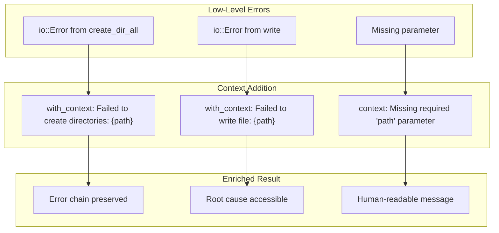

# Error Context Propagation

### From: write

Error context propagation is a robust error handling pattern implemented throughout the `WriteTool` using the `anyhow` crate, which transforms low-level failures into informative, actionable error messages that preserve the full chain of causation. This pattern addresses a common challenge in complex software systems where errors originating deep in the call stack—such as a failed directory creation or file write—lose meaningful context by the time they surface to users or logs. The `WriteTool` employs `with_context` and `context` methods to attach descriptive messages at each potential failure point, creating error chains that explain both what operation was attempted and why it failed, significantly improving debugging efficiency and operational observability.

The implementation of error context propagation in `WriteTool` demonstrates several sophisticated techniques for error handling in Rust. The `context` method is used for simple error augmentation, such as when extracting the "path" parameter fails with "Missing required 'path' parameter", converting a potentially cryptic `None` error into a clear description of the contract violation. The `with_context` method accepts closures for lazily evaluated context, used when formatting path information for directory creation and file write failures—this avoids string allocation overhead when operations succeed while ensuring detailed path information is captured when they fail. These patterns integrate with `anyhow`'s automatic error chaining to preserve the original `std::io::Error` or other underlying causes while surfacing semantic context.

The operational impact of comprehensive error context propagation extends to system reliability and developer experience in production agent deployments. When `WriteTool` fails in a production environment—whether due to permission issues, disk space exhaustion, or path resolution problems—the resulting error message contains sufficient information for immediate diagnosis without requiring reproduction or code inspection. The inclusion of specific paths, operation types, and parameter details in error contexts enables automated alerting and classification, supports structured logging integration, and facilitates root cause analysis in distributed tracing systems. This approach exemplifies the principle that errors are part of a system's interface and should be designed with the same care as success paths, particularly in infrastructure tools where failure modes directly impact user workflows.

## Diagram

## External Resources

- [Anyhow crate documentation](https://docs.rs/anyhow/latest/anyhow/) - Anyhow crate documentation
- [Comparison of Anyhow and thiserror for Rust error handling](https://michaeliscode.blogspot.com/2020/05/rust-anyhow-and-thiserror.html) - Comparison of Anyhow and thiserror for Rust error handling

## Sources

- [write](../sources/write.md)
