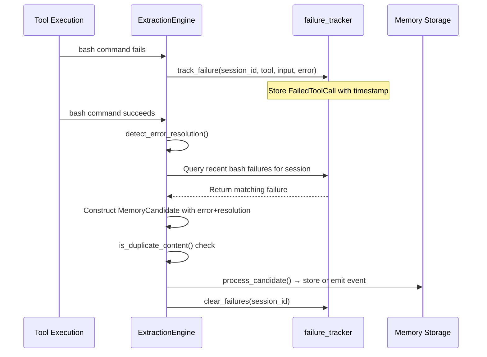

# Error-Resolution Detection

### From: extract

Error-resolution detection is a specialized pattern recognition technique that identifies when a failed operation is subsequently succeeded, capturing the implicit problem-solving process as explicit structured knowledge. This concept addresses a pervasive challenge in software development and system administration: the debugging and error-resolution process typically generates valuable experiential knowledge that is rarely preserved in accessible form. When a developer encounters an error, attempts various solutions, and eventually succeeds, the successful resolution often exists only in shell history, log files, or the developer's ephemeral working memory. The ExtractionEngine's implementation monitors bash tool executions specifically, maintaining a sliding window of recent failures that can be correlated with subsequent successes to generate MemoryCandidate entries documenting both the error condition and its resolution.

The technical implementation of error-resolution detection involves several sophisticated components. The failure_tracker maintains stateful records of FailedToolCall instances, scoped per-session to prevent spurious correlations across unrelated execution contexts. The tracking mechanism implements bounded retention (maximum 20 failures) with FIFO eviction, balancing comprehensive context preservation against resource constraints. Detection logic queries this history when successful bash executions occur, identifying the most recent matching failure and constructing a narrative description that combines the failed command, truncated error output, and indication of subsequent success. This temporal correlation—failure followed by success within the same session—serves as a proxy for causal resolution, acknowledging that while not all success-after-failure sequences represent genuine learning (the success might involve entirely different approaches), the pattern has sufficient predictive value to warrant capture.

The knowledge value of error-resolution entries extends beyond immediate reuse to encompass organizational learning and onboarding acceleration. Documented resolutions reduce repeated debugging of identical issues, enable proactive guidance for common pitfalls, and preserve expertise that might otherwise concentrate with individual team members. The ExtractionEngine's implementation captures command patterns and error messages with appropriate truncation for readability, generating entries categorized specifically as "error" with tags indicating bash context and project affiliation. The confidence scoring (0.7, relatively high among extraction types) reflects the system's assessment that temporal correlation of failure and success represents reliable learning signal. This confidence calibration enables downstream prioritization, ensuring that error-resolution memories surface prominently when users encounter similar issues. The broader significance of this concept lies in its demonstration that operational telemetry, processed with appropriate temporal and contextual reasoning, can yield structured knowledge of comparable value to explicitly authored documentation.

## Diagram

## External Resources

- [Root cause analysis methodology for systematic error resolution](https://en.wikipedia.org/wiki/Root_cause_analysis) - Root cause analysis methodology for systematic error resolution
- [Organizational knowledge management and experiential learning capture](https://en.wikipedia.org/wiki/Knowledge_management) - Organizational knowledge management and experiential learning capture
- [Case-based reasoning systems that retrieve prior solutions for similar problems](https://en.wikipedia.org/wiki/Case-based_reasoning) - Case-based reasoning systems that retrieve prior solutions for similar problems

## Related

- [Automatic Memory Extraction](automatic-memory-extraction.md)

## Sources

- [extract](../sources/extract.md)
