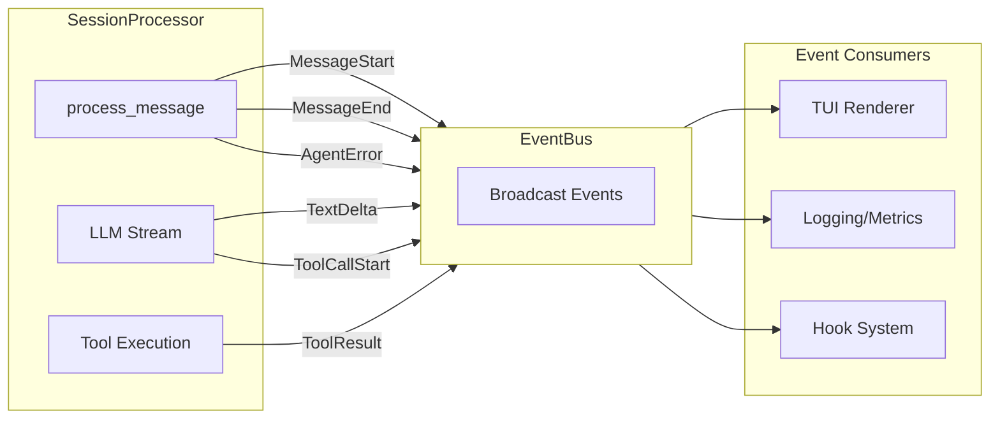

# Event-Driven Architecture for Agent Systems

### From: processor

Event-driven architecture in this codebase enables loose coupling between the core processing logic and UI components, with `EventBus` serving as the central publish-subscribe mechanism. The `SessionProcessor` publishes granular events throughout the processing lifecycle—`MessageStart`, `AgentError`, `MessageEnd`, `ToolsSent`, and stream-specific events like `TextDelta`—allowing the TUI to render progressive updates without blocking on completion. This pattern transforms what could be a synchronous blocking call into a streaming, responsive experience.

The event design shows careful attention to UI synchronization requirements. The `publish_error` closure demonstrates defensive programming: when processing fails, both an error event and a terminal `MessageEnd` event are published, ensuring the TUI resets its state regardless of failure mode. This prevents UI desynchronization where loading states persist indefinitely after backend errors. The `FinishReason` enumeration captured in `MessageEnd` enables differentiated UI treatment of normal completion versus cancellation versus errors.

The architecture scales to support multiple consumers beyond the primary TUI. Events like `ToolCallStart`, `ToolCallDelta`, and `ToolCallEnd` enable real-time visualization of tool execution progress, while `Usage` and `TokenUsage` events support cost tracking and observability. The `cancel_flag` mechanism integrates with this event model—cancellation is polled during streaming consumption, with events continuing to flow until graceful termination. This cooperative multitasking pattern prevents resource leaks while maintaining responsiveness.

## Diagram

## External Resources

- [Martin Fowler on event-driven architecture](https://martinfowler.com/articles/201701-event-driven.html) - Martin Fowler on event-driven architecture
- [Tokio select for cancellation patterns](https://tokio.rs/tokio/topics/select) - Tokio select for cancellation patterns

## Sources

- [processor](../sources/processor.md)
