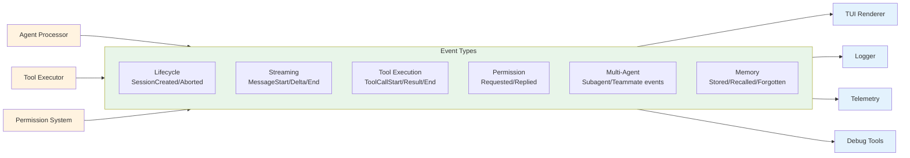

# Event-Driven Architecture

### From: mod

Event-driven architecture is a software design pattern where system behavior is determined by events—discrete, significant occurrences that announce state changes or actions—rather than direct method calls or polling. The ragent-core event module exemplifies this architecture through its comprehensive Event enum, where over 40 distinct event types capture every significant moment in an agent session's lifecycle. From SessionCreated to TeammateP2PMessage, each event represents a fact that has occurred, and components react to these facts rather than orchestrating behavior through imperative control flow.

This architectural style provides substantial benefits for complex agent systems. Decoupling is the primary advantage: the code that detects a condition (e.g., tool execution completion) and the code that responds to it (e.g., UI update, logging, next-step planning) need no direct knowledge of each other. They communicate through the event bus abstraction, allowing independent evolution of producer and consumer implementations. This modularity enables the diverse event types in ragent—spanning LLM interactions, permission gating, multi-agent coordination, memory operations, and infrastructure monitoring—to coexist without creating a tangled web of direct dependencies. New event types can be added without modifying existing consumers (which simply won't handle the new events), and new consumers can be added without touching event producers.

The event taxonomy in ragent reveals sophisticated understanding of agent system requirements. Core lifecycle events (SessionCreated, SessionAborted) bracket session existence. Streaming events (MessageStart, TextDelta, ReasoningDelta, MessageEnd) support incremental UI updates for responsive interfaces. Tool events (ToolCallStart, ToolCallArgs, ToolResult, ToolCallEnd) with timing and success information enable execution monitoring and debugging. Permission events implement security gates with asynchronous user interaction. Agent coordination events support hierarchical (SubagentStart) and peer-to-peer (TeammateSpawned, TeammateP2PMessage) multi-agent patterns. Memory and journal events provide observability into persistent state changes. This granularity—distinguishing, for example, MessageStart from the first TextDelta—allows precise state reconstruction and fine-grained reactive behaviors.

The implementation demonstrates mature event-driven practices: events are immutable facts with timestamps implied by ordering, carry complete context (session IDs, call IDs) for correlation, use structured data rather than opaque payloads, and follow consistent naming conventions. The #[must_use] on type_name and the careful derive macros show attention to API ergonomics. The TODO about Cow<'static, str> indicates ongoing optimization awareness for event payload efficiency in a high-throughput system.

## Diagram

## External Resources

- [Martin Fowler on event-driven architecture](https://martinfowler.com/articles/201701-event-driven.html) - Martin Fowler on event-driven architecture
- [Microsoft Azure event-driven architecture guide](https://docs.microsoft.com/en-us/azure/architecture/guide/architecture-styles/event-driven) - Microsoft Azure event-driven architecture guide

## Related

- [Broadcast Pattern](broadcast-pattern.md)

## Sources

- [mod](../sources/mod.md)

### From: team_spawn

Event-driven architecture permeates the `TeamSpawnTool` implementation, most prominently in the permission workflow's use of `tokio::sync::broadcast` channels for decoupled, asynchronous communication between system components. This pattern enables loose coupling between the tool execution logic and permission handling infrastructure, supporting flexible deployment topologies where authorization UI may run in separate threads, processes, or services. The `Event` type abstraction with variants like `PermissionRequested` and `PermissionReplied` suggests a unified event taxonomy across the framework, enabling cross-cutting concerns like logging, metrics, and state synchronization through common serialization formats and routing infrastructure.

The implementation demonstrates sophisticated handling of broadcast channel semantics including subscription management, lag detection, and graceful degradation. The explicit `RecvError::Lagged(n)` handling with warning logs indicates awareness that event bus backpressure may cause message loss, while `RecvError::Closed` handling with denial fallback ensures fail-secure behavior when communication infrastructure fails. The loop-based receive pattern with selective message filtering—matching both session ID and request ID—shows correct implementation of selective consumption on a broadcast medium where all subscribers receive all messages. These patterns reflect production experience with async Rust concurrency and the specific failure modes of broadcast channels under load.

Beyond the permission workflow, event-driven patterns appear in telemetry integration through `tracing` macros that emit structured events for observability consumption. The field-level event emission (`tracing::info!(session_id = %ctx.session_id, ...)`) integrates with broader ecosystem conventions for distributed tracing and log aggregation. The architecture suggests extensibility points where additional event handlers could subscribe to spawn events for metrics, billing, or workflow orchestration without modifying the core tool implementation. This event-centric design philosophy—internal state changes as observable, timestamped events rather than hidden mutations—supports debugging, testing, and evolution of complex distributed agent systems where understanding execution flow and timing is essential.

### From: wait_tasks

Event-driven architecture (EDA) is a software design paradigm where system behavior is determined by events—significant changes in state or notable occurrences—rather than synchronous request-response cycles. The WaitTasksTool exemplifies EDA by subscribing to `Event::SubagentComplete` notifications on a broadcast channel, allowing it to remain suspended and resource-efficient until relevant events occur. This approach fundamentally differs from polling, where the tool would repeatedly query task status at intervals, consuming CPU and network resources while introducing latency between completion and detection.

The implementation demonstrates key EDA patterns: the publish-subscribe model via Tokio's broadcast channels, event filtering by session ID and task ID to ignore irrelevant notifications, and event-driven state transitions where the arrival of a completion event directly modifies the waiting set. The careful ordering—subscribe before query—implements the "read-your-writes" consistency pattern, ensuring no events are lost to race conditions. This pattern is essential in distributed systems where network latency and scheduling variance make atomic operations impossible.

EDA provides significant advantages for agent orchestration: horizontal scalability through decoupled components, resilience through event persistence and replay capabilities, and natural modeling of asynchronous business processes. The trade-offs include increased complexity in error handling (must handle event loss, duplication, and ordering), eventual consistency semantics, and the need for sophisticated debugging tools. The WaitTasksTool's timeout mechanism acknowledges these realities, providing a safety net when the event-driven path fails.
