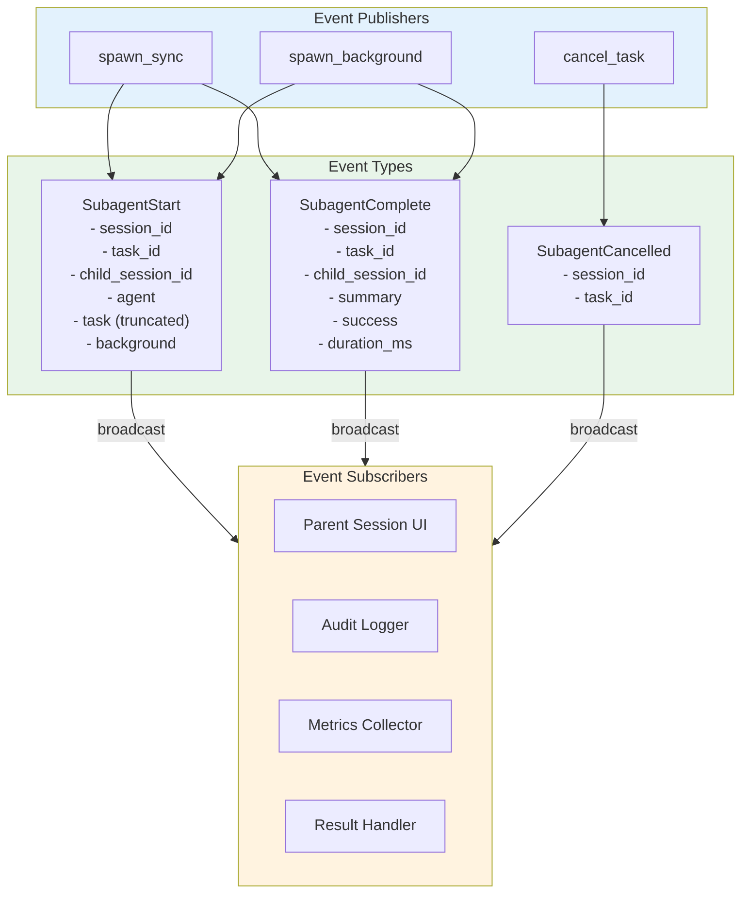

# Event-Driven Lifecycle Publishing

### From: mod

Event-driven lifecycle publishing establishes an observable, decoupled mechanism for tracking sub-agent execution without tight coupling between the task manager and result consumers. The TaskManager publishes three distinct event types through the EventBus: SubagentStart when task execution begins, SubagentComplete when execution finishes (regardless of success or failure), and SubagentCancelled when external cancellation occurs. This pattern enables multiple independent observers to react to task events without the task manager needing knowledge of their existence—parent sessions might update UI state, logging systems might persist audit records, monitoring systems might track completion rates, and downstream automation might trigger dependent workflows.

The event design carries rich context for debugging and analytics: SubagentStart includes the parent session ID, generated task ID, child session ID (for correlation with session logs), agent name, truncated task preview (200 characters), and execution mode flag. SubagentComplete adds success boolean, duration in milliseconds, and result summary, enabling performance tracking and outcome analysis. The explicit duration_ms field (rather than start/end timestamps) simplifies consumer aggregation and alerting on slow tasks. Events are published synchronously within the task lifecycle methods, ensuring delivery before method completion, with the EventBus handling any asynchronous propagation to subscribers.

The decoupling enables sophisticated operational patterns: a parent session can spawn background tasks and continue processing, with results arriving via event subscription when ready; a centralized dashboard can display real-time agent activity across all sessions by subscribing to the global event bus; and completion handlers can implement custom logic like result caching, notification dispatch, or automatic retry without modifying the task manager. The event types themselves are part of the crate's public API (via crate::event), allowing external code to match and handle them. This architecture supports the background execution model particularly well, where the spawning context may have moved on to other work by the time results are available—events provide the asynchronous notification mechanism that polling would otherwise require.

## Diagram

## External Resources

- [Tokio broadcast channel for event distribution](https://docs.rs/tokio/latest/tokio/sync/broadcast/) - Tokio broadcast channel for event distribution
- [Event-driven architecture patterns](https://martinfowler.com/articles/201701-event-driven.html) - Event-driven architecture patterns

## Sources

- [mod](../sources/mod.md)
