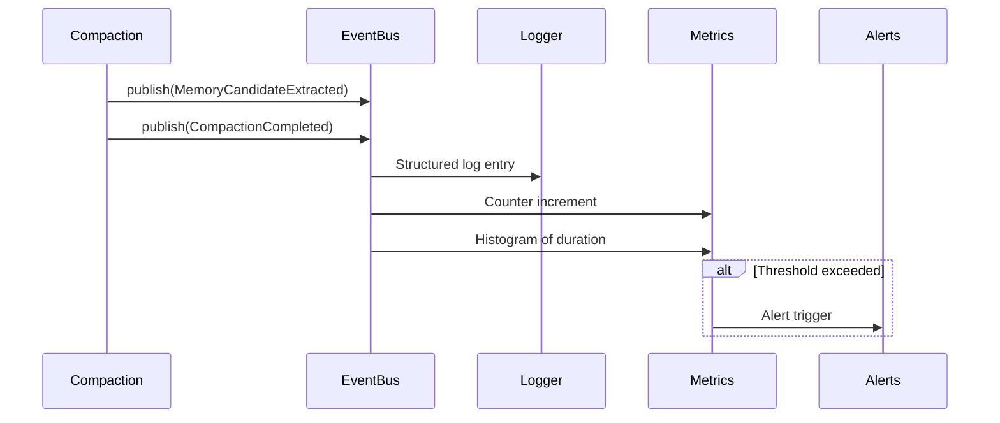

# Event-Driven Observability

### From: compact

Event-driven observability architectures decouple system instrumentation from monitoring consumption, enabling flexible telemetry pipelines that adapt to evolving operational requirements without code modification. The ragent compaction system integrates with an EventBus abstraction, publishing structured events for compaction operations that can be consumed by log aggregators, metrics systems, alerting infrastructure, or debugging interfaces. This pattern contrasts with direct logging or metrics emission, which tightly couples instrumentation decisions to specific backends and complicates testing and local development. The session_id parameter enables correlation of compaction events with specific user sessions or request contexts, supporting distributed tracing across asynchronous maintenance operations.

The specific event types implied by the source—MemoryCandidateExtracted for deduplication findings and implicit compaction completion events—provide semantically rich signals beyond raw log lines. Downstream consumers can implement sophisticated behaviors: alerting on compaction frequency spikes that might indicate upstream data quality issues, trending memory growth rates for capacity planning, or visualizing deduplication effectiveness as an embedding quality metric. The Arc<EventBus> shared ownership enables safe concurrent publication from background compaction tasks without lifetime complications, while the trait-based design permits testing with mock event buses that capture and assert on expected event sequences. This testing affordance is crucial for verifying that compaction triggers fire under correct conditions and that deduplication results propagate correctly through the merge confirmation workflow.

## Diagram

## External Resources

- [CloudEvents specification for interoperable event data](https://cloudevents.io/) - CloudEvents specification for interoperable event data
- [Rust tracing crate for structured diagnostic instrumentation](https://docs.rs/tracing/latest/tracing/) - Rust tracing crate for structured diagnostic instrumentation

## Sources

- [compact](../sources/compact.md)
