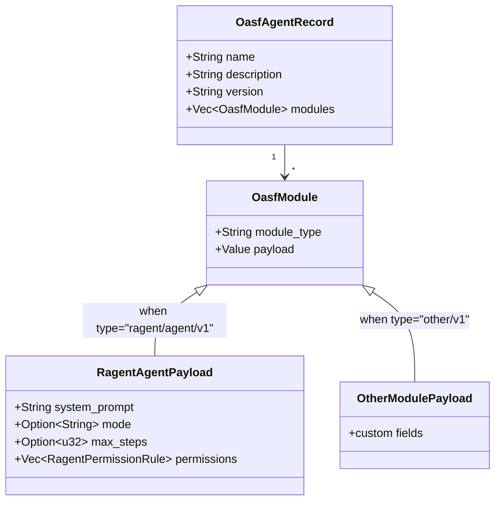

# Extension Module Architecture

### From: oasf

Extension module architectures enable standardized envelope formats to accommodate implementation-specific features without sacrificing interoperability. The OASF module system exemplifies this pattern through the `OasfModule` structure, which uses a type discriminator and opaque JSON payload to create a forward-compatible extension point. This design allows the core OASF specification to remain stable while individual implementations evolve their proprietary configuration structures, preventing schema fragmentation that would otherwise occur if every vendor extended the base specification differently.

The ragent implementation demonstrates effective use of this pattern through the `RAGENT_MODULE_TYPE` constant (`"ragent/agent/v1"`) and corresponding `RagentAgentPayload` structure. The payload contains rich runtime configuration including templated system prompts, execution mode selection, model binding specifications, and permission rulesets—features that would be inappropriate for inclusion in a cross-vendor standard but essential for ragent's functionality. The opaque `serde_json::Value` type in the base `OasfModule` allows deserialization to proceed without knowledge of specific payload structures, with secondary parsing converting the generic value to typed structures when the module type is recognized.

This architectural pattern has significant implications for ecosystem evolution. New ragent versions can add fields to `RagentAgentPayload` without breaking compatibility with older OASF parsers that ignore unknown module types. Conversely, agents can be defined with multiple module types for different runtimes, enabling polyglot agent definitions that execute appropriately across different platforms. The validation requirement noted in source comments—that modules "must contain exactly one `ragent/agent/v1` module"—indicates thoughtful constraints preventing ambiguous configurations while preserving the theoretical ability to include other module types for complementary purposes.

## Diagram

## External Resources

- [Plugin pattern by Martin Fowler](https://www.martinfowler.com/eaaCatalog/plugin.html) - Plugin pattern by Martin Fowler

## Sources

- [oasf](../sources/oasf.md)
