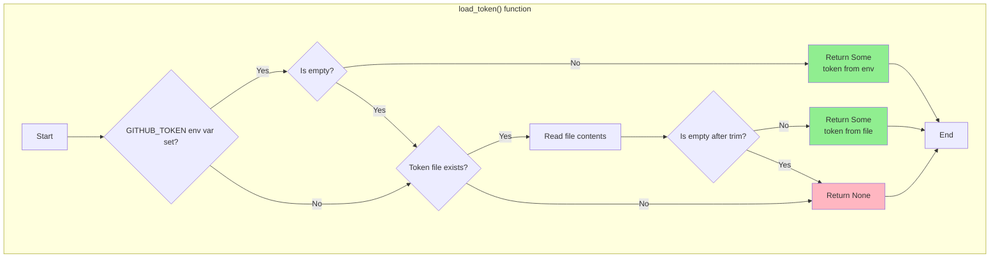

# Fallback Configuration Resolution

### From: auth

Hierarchical configuration resolution enables flexible deployment of applications across diverse environments while maintaining security and convenience. The `load_token` function implements a prioritized fallback chain that exemplifies the twelve-factor app methodology for configuration management. The resolution order—environment variable first, then file-based storage—reflects a deliberate security and operational design. Environment variables take precedence because they enable secure injection through secrets management systems, container orchestration platforms, and CI/CD pipelines without persistent filesystem exposure. This supports ephemeral execution environments where filesystem state is undesirable or impossible. The file-based fallback provides convenience for interactive development and long-lived CLI sessions, persisting credentials across process invocations. The implementation includes defensive validation at each step: empty strings are rejected, preventing accidental activation of fallback levels when variables are set but undefined. The `Option<String>` return type elegantly represents the ternary outcome of this resolution—some valid token, explicitly no token, or implicit none through propagation of inner `Option` failures. This pattern extends naturally to hierarchical configuration systems with additional layers like command-line arguments, configuration files, and remote configuration services, each with appropriate precedence and override semantics.

## Diagram

## External Resources

- [Twelve-Factor App: Config](https://12factor.net/config) - Twelve-Factor App: Config
- [Kubernetes Secrets documentation](https://kubernetes.io/docs/concepts/configuration/secret/) - Kubernetes Secrets documentation
- [GitHub Actions encrypted secrets](https://docs.github.com/en/actions/security-guides/encrypted-secrets) - GitHub Actions encrypted secrets

## Sources

- [auth](../sources/auth.md)
