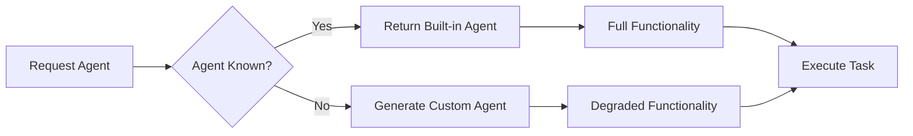

# Fallback Pattern

### From: test_agent

The fallback pattern is a resilience-oriented design strategy where systems provide default or degraded behavior when primary operations cannot be fulfilled, rather than failing completely. In ragent-core's agent resolution system, this pattern manifests through the custom agent fallback mechanism: when an unknown agent name is requested, instead of returning an error, the system generates a functional custom agent configuration. This approach transforms what could be a failure scenario into a degraded success scenario, maintaining system availability and user productivity.

The implementation of fallback patterns requires careful consideration of user expectations and system invariants. The test case `test_agent_resolve_unknown_fails` ironically demonstrates success through its assertions—the "failure" case actually unwraps successfully, with the resulting agent containing the originally requested name and a descriptive indication of its custom status. This preserves the contract that agent resolution yields a usable agent while signaling through metadata that the result is synthetic rather than curated.

Fallback patterns trade strict correctness for availability, a common tension in production system design. The ragent-core implementation suggests this tradeoff was intentional and appropriate for the domain, where blocking user workflows due to unrecognized agent names would provide poor experience. The pattern also enables forward compatibility—clients using newer agent names can function with older system versions, receiving custom fallbacks until built-in definitions are available. This is particularly valuable in rapidly evolving AI tooling ecosystems where new specialized agents emerge frequently.

## Diagram

## External Resources

- [Azure Retry Pattern - Microsoft guidance on resilience patterns including fallbacks](https://docs.microsoft.com/en-us/azure/architecture/patterns/retry) - Azure Retry Pattern - Microsoft guidance on resilience patterns including fallbacks
- [Graceful Degradation - foundational concept for fallback patterns](https://en.wikipedia.org/wiki/Graceful_degradation) - Graceful Degradation - foundational concept for fallback patterns

## Related

- [Agent Resolution](agent-resolution.md)
- [Defensive Programming](defensive-programming.md)

## Sources

- [test_agent](../sources/test-agent.md)
