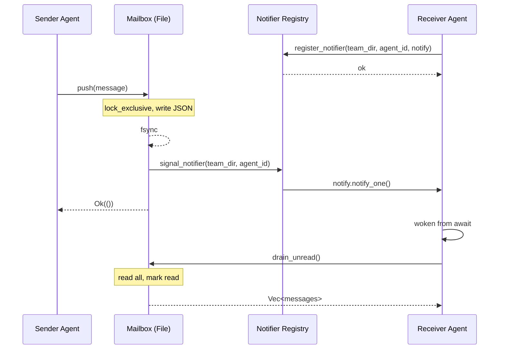

# File-Backed Messaging with Real-Time Notification

### From: mailbox

This architectural pattern combines durable, filesystem-based message storage with asynchronous notification mechanisms to achieve both reliability and responsiveness. Traditional messaging systems often face a trade-off: in-memory queues (fast, ephemeral) versus persistent storage (durable, slower). The mailbox system resolves this tension by using JSON files as the authoritative message store while maintaining in-process `Notify` handles for immediate wake-up, creating a hybrid architecture that serves the specific needs of multi-agent coordination.

The pattern operates through a clear separation of concerns: the filesystem provides durability across crashes and restarts, with JSON serving as a human-readable, debuggable format that operators can inspect and modify. The notifier registry adds the performance layer, eliminating polling latency without sacrificing durability guarantees. When a message arrives, it's immediately committed to disk (via `push`), then the notifier signals any waiting async task. If the recipient is not currently waiting, the message remains safely stored for later retrieval via `drain_unread`.

This design specifically addresses the requirements of agent systems where agents may restart, crash, or be debugged offline. The file format allows post-mortem analysis—understanding what messages were pending when an agent failed. The real-time notification ensures responsive coordination during normal operation, critical for workflows like plan approval where the lead must quickly respond to teammate submissions. The pattern demonstrates how modern Rust async capabilities can enhance traditional persistent messaging without complexity explosion.

The implementation carefully manages the complexity boundary between sync and async code: file operations remain synchronous (wrapped in blocking calls if needed) while notification uses Tokio's async primitives. The global `OnceLock` registry introduces shared mutable state but protects it with `RwLock`, allowing concurrent reads (notifier lookups) while serializing mutations (registration/deregistration). This pattern is particularly valuable in embedded or constrained environments where external message brokers (Redis, RabbitMQ) represent unacceptable operational overhead, providing self-contained messaging within the filesystem.

## Diagram

## External Resources

- [Tokio async patterns and channel primitives](https://tokio.rs/tokio/tutorial/channels) - Tokio async patterns and channel primitives
- [Tokio Notify documentation for async signaling](https://docs.rs/tokio/latest/tokio/sync/struct.Notify.html) - Tokio Notify documentation for async signaling

## Related

- [Event-Driven Architecture](event-driven-architecture.md)

## Sources

- [mailbox](../sources/mailbox.md)
