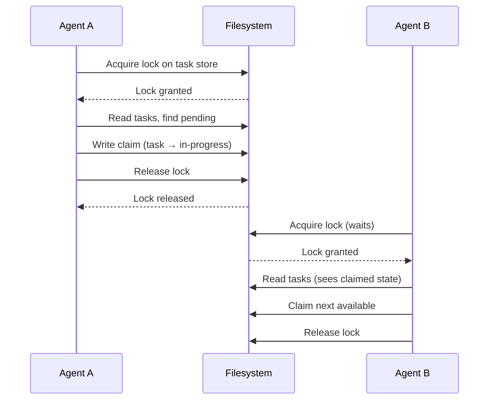

# File-Based Locking

### From: team_task_claim

File-based locking is a coordination mechanism that uses filesystem operations to implement mutual exclusion between concurrent processes, serving as the consistency foundation for the TaskStore in this implementation. Unlike in-memory locks that vanish with process termination, file locks persist until explicitly released, providing crash tolerance and enabling recovery scenarios where agents can determine task ownership after unexpected termination. The technique leverages operating system primitives—typically fcntl locks on Unix or LockFile on Windows—to achieve kernel-enforced serialization without additional infrastructure.

The implementation pattern involves creating lock files or applying advisory locks to data files before mutation operations, holding the lock through the critical section, and releasing immediately afterward to minimize contention duration. In the task claiming context, this ensures that the read-modify-write sequence evaluating task availability and updating ownership occurs atomically from other agents' perspectives. The approach's portability across platforms and languages makes it suitable for polyglot agent systems, though it requires careful handling of edge cases like lock file cleanup after crashes and network filesystem semantics that may not propagate locks consistently.

File-based locking occupies a middle ground in the consistency spectrum between optimistic concurrency (last-write-wins with conflict detection) and strong consistency (distributed consensus protocols). It provides sufficient isolation for single-node or shared-filesystem deployments while avoiding the latency and complexity of systems like ZooKeeper, etcd, or Raft implementations. The technique's limitations—including poor scaling under high contention and sensitivity to filesystem implementation details—inform appropriate deployment contexts. For the TeamTaskClaimTool, these tradeoffs are acceptable given expected claim frequencies and the preference for operational simplicity over extreme performance.

## Diagram

## External Resources

- [File locking mechanisms in operating systems](https://en.wikipedia.org/wiki/File_locking) - File locking mechanisms in operating systems
- [Rust standard library file operations documentation](https://doc.rust-lang.org/nightly/std/fs/struct.File.html) - Rust standard library file operations documentation

## Related

- [Atomic Task Claiming](atomic-task-claiming.md)

## Sources

- [team_task_claim](../sources/team-task-claim.md)
