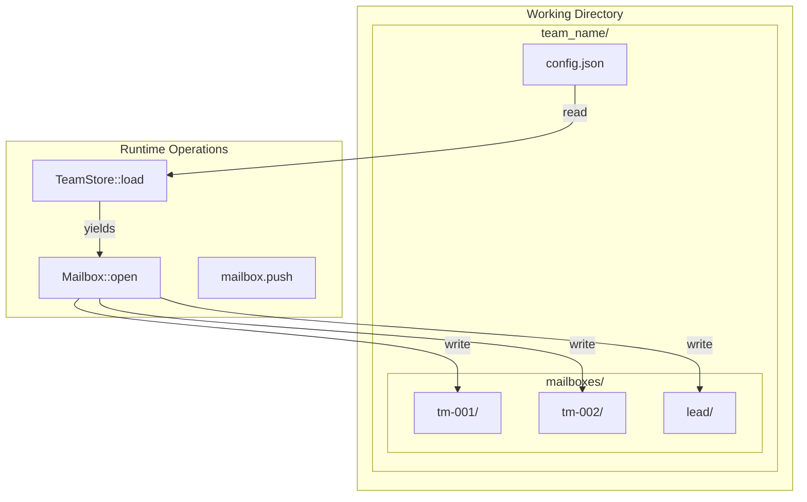

# Filesystem-Based Persistence

### From: team_message

Filesystem-based persistence refers to architectural approaches that use the operating system's file abstraction for durable storage rather than database management systems or specialized storage services. The code under analysis demonstrates this pattern through `TeamStore::load`, `Mailbox::open`, and `find_team_dir` operations, which locate and manipulate team configurations and messages as files and directories. This approach trades some query flexibility and concurrent performance for operational simplicity, debuggability, and version control integration.

The design choices visible in the code suggest a workspace-oriented model where each team occupies a dedicated directory structure, with configuration in `config.json` and messages in per-agent mailboxes. This organization mirrors development workspace conventions, making the system intuitive for software developers and enabling standard tools—text editors, `grep`, `rsync`, `git`—to interact with team state. The `find_team_dir` function's signature implies a search algorithm that locates team directories within a working directory, supporting multiple teams per workspace and potentially nested or referenced team structures.

Error handling in filesystem-centric designs requires careful attention to race conditions, partial writes, and cross-platform path handling. The code's use of `?` propagation and `anyhow` context suggests awareness of these concerns, though production implementations would need additional safeguards: atomic writes through temporary files and rename operations, file locking for mailbox access, and graceful handling of permission errors. The `Result` types throughout the API surface force callers to confront failure modes that might be hidden in higher-level abstractions, aligning with Rust's philosophy of explicit error handling.

The trade-offs of this approach become apparent when considering scalability and query patterns. Filesystems excel at hierarchical organization and streaming access but struggle with complex queries, concurrent writers, and fine-grained transactions. The mailbox implementation likely uses append-only files or simple file-per-message structures to minimize write conflicts, accepting that listing, searching, or aggregating messages requires linear scans. For systems where message volume grows large or cross-mailbox queries are common, migration to database-backed storage would become necessary, though the abstraction boundaries shown here—`TeamStore`, `Mailbox`—would ease such transitions by containing persistence details within replaceable modules.

## Diagram

## External Resources

- [JSON Lines format for structured logging](https://jsonlines.org/) - JSON Lines format for structured logging
- [SQLite's approach to atomic commits](https://www.sqlite.org/atomiccommit.html) - SQLite's approach to atomic commits
- [Rust filesystem module documentation](https://doc.rust-lang.org/std/fs/) - Rust filesystem module documentation

## Sources

- [team_message](../sources/team-message.md)
