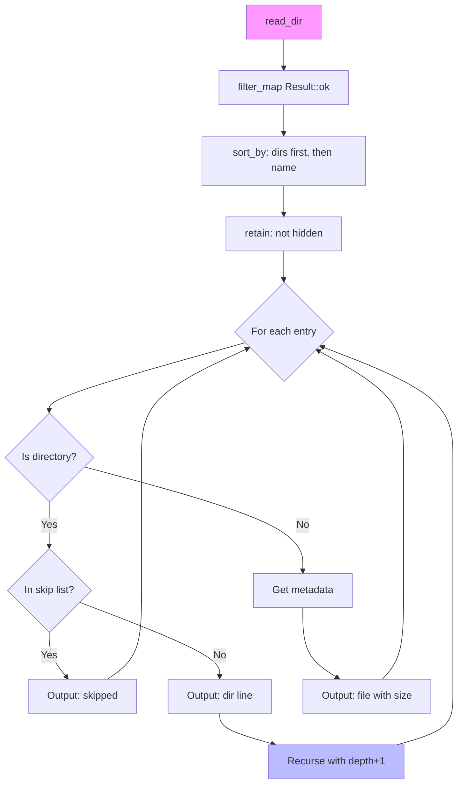

# Filesystem Traversal with Filtering

### From: list

Filesystem traversal algorithms form the foundation of countless software systems, yet their apparent simplicity conceals substantial complexity in production implementations. The naive recursive approach—enumerating directory entries and recursing into subdirectories—encounters immediate practical challenges: cyclic structures via symbolic links, permission boundaries, resource exhaustion from deep or wide hierarchies, and noise from generated or temporary content. The `list.rs` implementation addresses these concerns through a multi-layer filtering strategy that demonstrates mature engineering judgment about which complexities to handle explicitly versus which to defer or exclude. The core traversal in `list_recursive` uses `std::fs::read_dir` for efficient kernel-mediated enumeration, with immediate `filter_map(Result::ok)` to skip entries that cannot be accessed, a permissive strategy that maintains progress despite partial permission failures.

The sorting and filtering pipeline in the implementation reveals sophisticated prioritization of user experience over completeness. Entries undergo a custom `sort_by` that elevates directories above files, creating visual grouping that aids navigation, with alphabetical ordering within categories for scanability. This non-lexicographic ordering violates typical filesystem enumeration but produces output aligned with how developers conceptualize project structures—grouping concerns before individual files. The `retain` operation filters hidden files (dot-prefix) based on the common convention that these represent configuration or cache rather than primary content, though this Unix-centric assumption may not align with all user expectations. The explicit skip list for `node_modules`, `target`, `.git`, `__pycache__`, `dist`, and `build` demonstrates domain knowledge about development workflows, where these directories frequently dominate size and entry count while contributing minimal semantic value to structure understanding.

Resource management in traversal receives careful attention through the `max_depth` parameter and depth tracking. Unlike approaches that might use a work queue or iterative deepening, this implementation uses recursion with explicit depth limits, trading stack depth for implementation clarity. The `saturating_sub` in entry counting and depth arithmetic defends against underflow in edge cases, though the unsigned types make overflow unlikely for realistic depths. The decision to skip rather than traverse large directories maintains responsiveness—encountering a `node_modules` directory with hundreds of thousands of entries would produce unusable output and consume excessive time, while the `(skipped)` annotation maintains awareness that content exists. This tradeoff between completeness and utility reflects product-oriented thinking rather than pure algorithmic correctness.

Error handling strategy in filesystem traversal requires navigating between fail-fast and best-effort philosophies. The `with_context` attachment to `read_dir` failures provides diagnostic information without crashing the entire operation, enabling partial results when permission issues affect subtrees. The absence of symlink cycle detection suggests either an assumption that the environment prevents cycles (via `read_dir` following behavior) or an accepted risk of stack overflow on malicious inputs—a limitation that production hardening might address through visited-path tracking. The metadata size retrieval with `unwrap_or(0)` fallback gracefully handles race conditions where files are deleted between directory enumeration and stat calls, a common occurrence in active development environments. These defensive patterns collectively produce a tool that succeeds in common cases, degrades gracefully in edge cases, and provides actionable diagnostics when intervention is required.

## Diagram

## External Resources

- [Rust documentation for read_dir and directory iteration](https://doc.rust-lang.org/std/fs/fn.read_dir.html) - Rust documentation for read_dir and directory iteration
- [Secure Programming HOWTO on filesystem race conditions](https://dwheeler.com/secure-programming/Secure-Programs-HOWTO/avoid-race.html) - Secure Programming HOWTO on filesystem race conditions
- [walkdir crate - mature Rust directory traversal with cycle detection](https://github.com/BurntSushi/walkdir) - walkdir crate - mature Rust directory traversal with cycle detection

## Related

- [Defensive Programming](defensive-programming.md)

## Sources

- [list](../sources/list.md)
