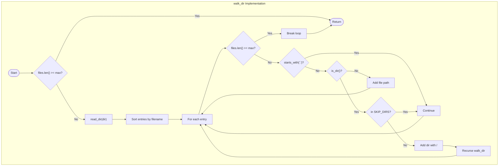

# Filesystem Traversal

### From: fuzzy

Filesystem traversal refers to the algorithmic process of systematically visiting all files and directories within a directory tree. This fundamental operation in systems programming requires careful handling of hierarchical structures, symbolic links, permission boundaries, and resource constraints. The implementation in this document demonstrates a depth-first recursive approach with explicit limits and exclusions to manage complexity in real-world filesystems.

The traversal algorithm implemented here includes several sophisticated considerations often overlooked in naive implementations. It maintains a maximum file count to prevent unbounded execution in directories with extreme file counts, skips hidden entries (those beginning with `.`) to avoid configuration files and version control metadata, and explicitly excludes well-known generated directories that would contain irrelevant build artifacts. The sorting of directory entries before processing ensures deterministic output ordering, which aids in testing and provides consistent user experience.

A notable design decision is the treatment of directory entries themselves as valid results, marked with trailing separators. This allows users to navigate to directories as well as files, expanding the utility of the fuzzy matcher beyond simple file opening to support broader workspace navigation. The error handling strategy—silently skipping directories that cannot be read—reflects the pragmatic reality that modern filesystems contain numerous permission-restricted areas that should not interrupt the overall operation. This graceful degradation is essential for tools meant to assist rather than enforce strict filesystem policies.

## Diagram

## External Resources

- [Rust standard library: read_dir documentation](https://doc.rust-lang.org/std/fs/fn.read_dir.html) - Rust standard library: read_dir documentation
- [Wikipedia: Tree traversal algorithms](https://en.wikipedia.org/wiki/Tree_traversal) - Wikipedia: Tree traversal algorithms

## Sources

- [fuzzy](../sources/fuzzy.md)
