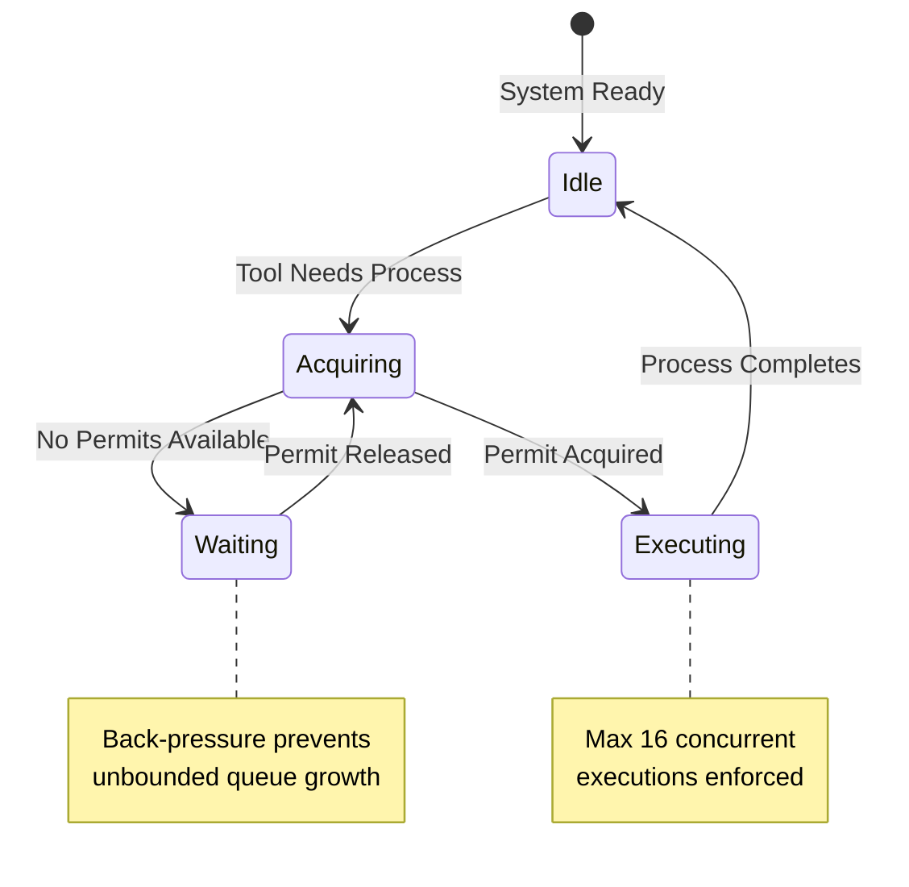

# Fork Bomb Prevention

### From: resource

Fork bomb prevention is a critical security and reliability concern in systems that permit subprocess spawning, particularly autonomous agent systems where the calling code may not be fully trusted or predictable. A fork bomb occurs when a process rapidly creates child processes, each of which creates more children, exponentially consuming system resources and potentially causing denial of service. In agent architectures, this risk is elevated because language models may generate tool use patterns that inadvertently trigger cascading process creation, or malicious prompts might attempt to exploit the system. The concurrency limit of 16 processes in this codebase represents a conservative bound that contains potential damage while remaining practical for legitimate workloads. The semaphore-based approach provides specific advantages over rate limiting: it bounds instantaneous consumption rather than average rates, it naturally coordinates across all execution paths, and it provides immediate back-pressure that can propagate to requesting tasks. The design assumes that blocked tasks are preferable to system failure, a key principle in resilient system design.

## Diagram

## External Resources

- [Fork bomb concept on Wikipedia](https://en.wikipedia.org/wiki/Fork_bomb) - Fork bomb concept on Wikipedia
- [AI agent security considerations](https://cloud.google.com/blog/products/ai-machine-learning/using-ai-to-fix-security-vulnerabilities) - AI agent security considerations

## Related

- [Application-Level Resource Limits](application-level-resource-limits.md)

## Sources

- [resource](../sources/resource.md)
