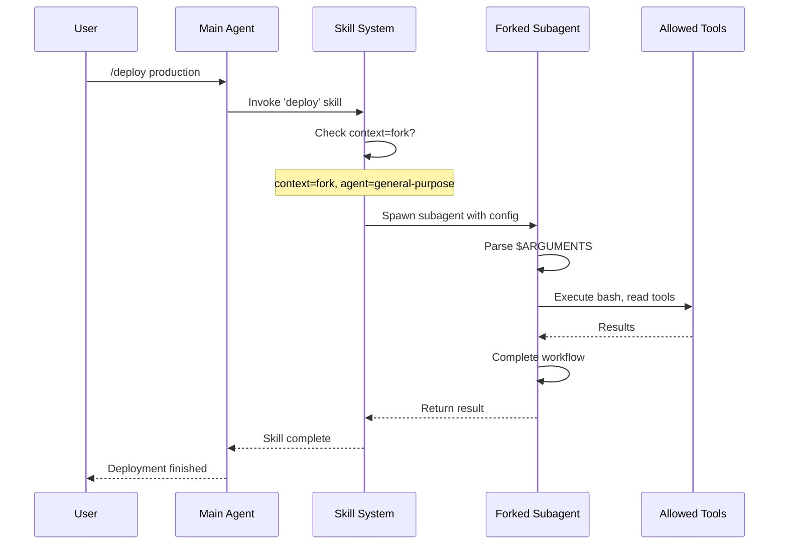

# Forked Execution Context

### From: loader

Forked execution context is an advanced skill configuration that creates isolated subagent processes for executing skill logic, preventing pollution of the main agent's state and enabling concurrent or independent operation chains. When `context: fork` is specified in a skill's frontmatter, the Ragent system spawns a dedicated subagent instance—configured via the `agent` field (e.g., `agent: general-purpose`)—to handle the skill's execution. This pattern is particularly valuable for long-running operations, potentially dangerous commands that might affect global state, or workflows requiring specialized agent configurations different from the main session. The `is_forked()` method on `SkillInfo` provides runtime introspection of this property. Forked contexts enable sophisticated workflows like deployment pipelines that run independently while the main agent continues interactive work, or specialized analysis tasks using different model configurations. The isolation ensures that tool executions, context modifications, and errors within the forked skill don't propagate to the primary agent session, maintaining stability and predictability.

## Diagram

## External Resources

- [Fork system call concept in operating systems](https://en.wikipedia.org/wiki/Fork_(system_call)) - Fork system call concept in operating systems
- [Anthropic's computer use and agent isolation patterns](https://docs.anthropic.com/en/docs/build-with-claude/computer-use) - Anthropic's computer use and agent isolation patterns

## Sources

- [loader](../sources/loader.md)
