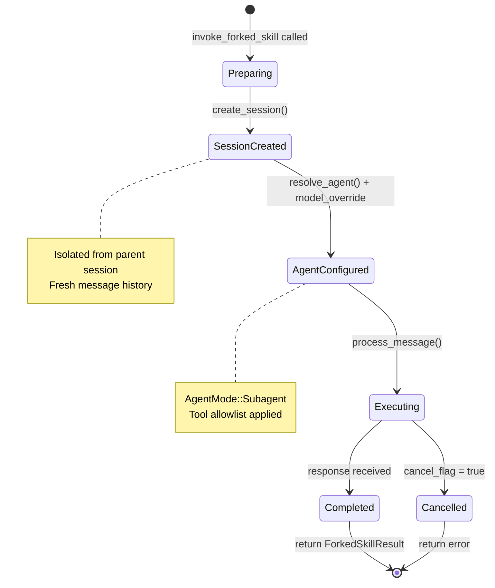

# Forked Skill Execution

### From: invoke

Forked skill execution implements hierarchical agent delegation, enabling skills to run with full agent capabilities in isolated sub-sessions while maintaining integration with parent conversation flow. This architectural pattern addresses fundamental tensions in compound AI systems: skills requiring extended tool chains or multi-turn reasoning need agent loop semantics, but embedding such execution directly into parent conversations risks context window pollution, state contamination, and unbounded execution scope. The forked execution model creates explicit boundaries where skills execute as complete agent sessions, with results summarized and reintegrated into parent contexts.

The execution flow through invoke_forked_skill demonstrates sophisticated session orchestration. The function receives a pre-processed SkillInvocation containing execution parameters, creates a fresh session through SessionManager, resolves the appropriate agent configuration (defaulting to "general" but supporting skill-specific overrides like "explore"), applies optional model overrides with flexible provider/model syntax, and executes the skill content through the standard process_message pathway. The resulting ForkedSkillResult contains only the essential outputs—subagent response and session identifier—enabling parent agents to make informed decisions about result integration without inheriting full conversation baggage.

Configuration flexibility in forked execution supports diverse operational patterns. The fork_agent field maps to agent archetypes with distinct behavior profiles—"explore" agents might prioritize breadth-first search strategies, "code" agents might emphasize precise tool execution, while "general" agents balance capabilities. Model overrides enable cost optimization (running extensive analysis on cheaper models) or capability matching (using vision models for image-heavy skills). The AgentMode::Subagent assignment ensures proper telemetry categorization and potentially modified behavior compared to top-level interactive sessions. Cancellation flag sharing respects user agency, allowing interruption of long-running forked operations without session state corruption.

## Diagram

## External Resources

- [Anthropic research on building effective agent systems](https://www.anthropic.com/research/building-effective-agents) - Anthropic research on building effective agent systems
- [LangGraph multi-agent patterns and hierarchical execution](https://langchain-ai.github.io/langgraph/concepts/multi_agent/) - LangGraph multi-agent patterns and hierarchical execution

## Related

- [Dynamic Context Injection](dynamic-context-injection.md)

## Sources

- [invoke](../sources/invoke.md)
