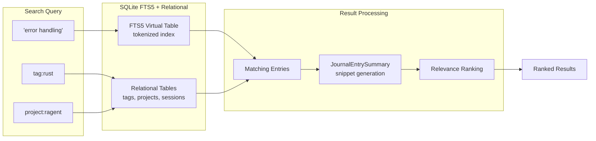

# Full-Text Search

### From: journal

Full-text search (FTS) is an information retrieval capability integrated into the Ragent journal system through SQLite's FTS5 extension, enabling efficient querying of unstructured text content across entry titles and bodies without exact-match limitations. Unlike relational queries that filter based on structured fields, full-text search operates on tokenized document representations, breaking text into searchable terms, normalizing case and punctuation, and building inverted indices that map each term to its containing documents. The `journal.rs` implementation leverages this through a dedicated virtual table `journal_fts` that shadows the `title` and `content` columns of `journal_entries`, automatically maintained by SQLite's FTS5 engine to provide sub-linear query performance regardless of corpus size.

The specific FTS5 configuration in the documented schema uses the external content table pattern, where the virtual table contains no data directly but references the authoritative `journal_entries` table via the `content=journal_entries` directive. This design choice optimizes storage by avoiding duplication of potentially large content fields—only the tokenized index structures are duplicated, not the raw text—while maintaining transactional consistency: updates to `journal_entries` automatically propagate to `journal_fts` within the same database transaction. The `JournalEntrySummary` type complements this architecture by providing truncated 200-character snippets for result display, balancing the completeness needed for relevance judgment with the bandwidth and rendering constraints of search result interfaces.

Full-text search transforms the journal from a simple chronological log into a queryable knowledge base where agents and developers can discover relevant historical observations through semantic similarity rather than precise recall. The integration of FTS5 with relational tags enables hybrid queries combining content relevance with categorical constraints—finding entries about "error handling" that are specifically tagged "rust" and belong to a particular project session. This capability is essential for agent learning and reasoning, where pattern recognition across accumulated experience requires efficient retrieval of analogically similar situations. The choice of SQLite FTS5 specifically reflects deployment pragmatism: it requires no external search infrastructure, operates within the same transactional scope as other data, and provides professional-grade search functionality including ranking, highlighting, and complex boolean query syntax that would be prohibitive to implement manually.

## Diagram

## External Resources

- [Official SQLite FTS5 documentation](https://www.sqlite.org/fts5.html) - Official SQLite FTS5 documentation
- [Full-text search - Wikipedia](https://en.wikipedia.org/wiki/Full-text_search) - Full-text search - Wikipedia
- [PostgreSQL Full Text Search (comparable implementation)](https://www.postgresql.org/docs/current/textsearch.html) - PostgreSQL Full Text Search (comparable implementation)

## Related

- [Hybrid Search](hybrid-search.md)

## Sources

- [journal](../sources/journal.md)
