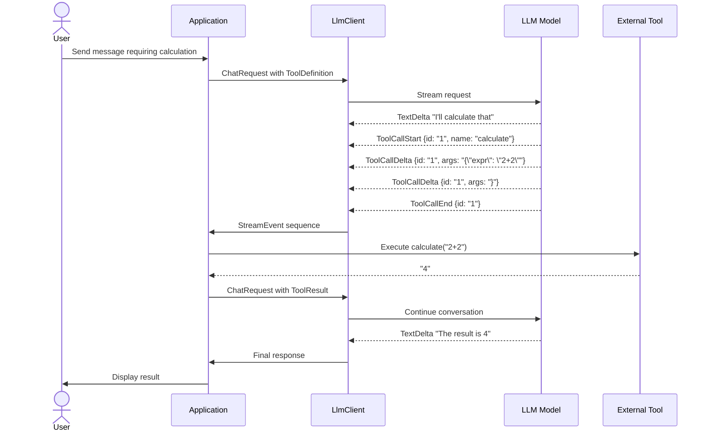

# Function Calling / Tool Use

### From: mod

Function calling, interchangeably called tool use in this module, enables LLMs to extend their capabilities by invoking external software functions described through schemas. This paradigm transforms LLMs from passive text generators into active agents that can query databases, calculate precise values, access real-time information, and interact with APIs. The architectural pattern involves three phases: definition (providing `ToolDefinition` schemas to the model), invocation (model generating structured call requests), and execution (application running the actual function and returning results). This module's types support all phases through `ToolDefinition`, `ContentPart::ToolUse`, and `ContentPart::ToolResult`.

The design addresses several challenges in reliable tool use. Schema compatibility requires JSON Schema for parameter description, though the current `Value` type defers validation to runtime. Call correlation uses unique identifiers generated by models (`ToolUse.id`) matched in results (`ToolResult.tool_use_id`), enabling parallel tool execution and out-of-order responses. Streaming support via `ToolCallStart`, `ToolCallDelta`, and `ToolCallEnd` events handles large JSON arguments that arrive incrementally, with applications accumulating fragments until `ToolCallEnd` signals completion. This streaming is crucial for complex arguments like large filter specifications or nested objects.

Security and reliability considerations permeate tool use implementations. The model generates arguments but never executes them—application code validates, potentially with additional authorization checks, before calling actual functions. The separation between `ToolUse` (model output) and `ToolResult` (application output) creates clear trust boundaries. Error handling must distinguish between malformed arguments (application returns error in `ToolResult`), execution failures (application describes failure), and model refusals (model declines to call despite availability). The pattern enables sophisticated agent architectures: recursive tool use where results inform further calls, multi-step workflows, and human-in-the-loop approvals for sensitive operations.

## Diagram

## External Resources

- [OpenAI function calling guide](https://platform.openai.com/docs/guides/function-calling) - OpenAI function calling guide
- [Anthropic Claude tool use documentation](https://docs.anthropic.com/en/docs/build-with-claude/tool-use) - Anthropic Claude tool use documentation
- [Understanding JSON Schema](https://json-schema.org/understanding-json-schema/) - Understanding JSON Schema

## Sources

- [mod](../sources/mod.md)
