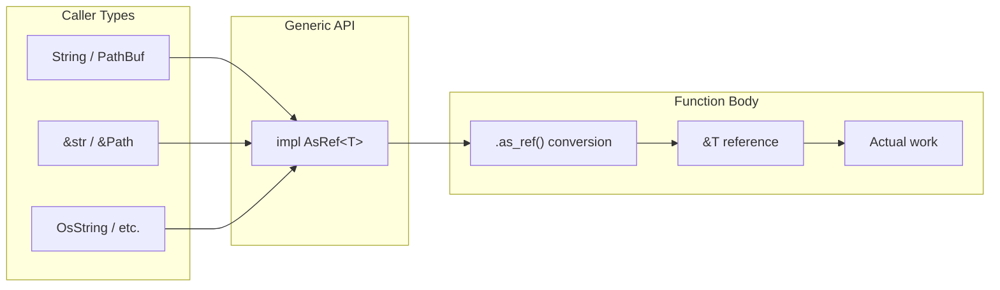

# Generic Programming with AsRef

### From: format

The `format.rs` module extensively uses the `AsRef` trait as a generic bound to create flexible, ergonomic APIs that accept multiple input types without explicit conversion. Functions like `format_summary_content`, `format_status_output`, `format_simple_summary`, and `format_display_path` all employ `impl AsRef<str>` or `impl AsRef<Path>` parameters. This pattern allows callers to pass owned `String`, borrowed `&str`, or any other type implementing `AsRef<str>`—including `OsStr` through appropriate conversions—without manual `.as_ref()` or `.to_string()` calls at the call site.

The `AsRef` trait provides a cheap, reference-to-reference conversion, making it ideal for functions that only need to read data without taking ownership. In `format_summary_content`, both parameters use this bound, enabling natural calling patterns like `format_summary_content(String::from("summary"), "content")` where the types differ. The implementation immediately calls `.as_ref()` to obtain `&str` views, then proceeds with string formatting. This zero-cost abstraction eliminates API duplication that would otherwise require separate `String` and `&str` overloads.

For paths, `impl AsRef<std::path::Path>` similarly accepts `PathBuf`, `&Path`, or string types that can convert to paths. The `format_display_path` function demonstrates this flexibility by accepting both path parameters generically, then converting via `.as_ref()` to `&Path` for actual path operations. This pattern is particularly valuable for paths where ownership semantics matter—callers can pass borrowed paths when they have them, or owned `PathBuf` when needed, without the function forcing either choice. The module's consistent use of this pattern across its public API demonstrates idiomatic Rust API design that prioritizes caller convenience while maintaining zero runtime overhead.

## Diagram

## External Resources

- [Rust AsRef trait documentation](https://doc.rust-lang.org/std/convert/trait.AsRef.html) - Rust AsRef trait documentation
- [Rust API guidelines on flexible inputs](https://rust-lang.github.io/api-guidelines/flexibility.html) - Rust API guidelines on flexible inputs

## Related

- [Content Format Patterns](content-format-patterns.md)
- [Human-Readable Formatting](human-readable-formatting.md)

## Sources

- [format](../sources/format.md)
