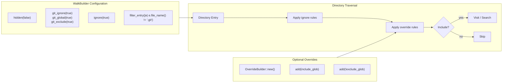

# Gitignore-Semantic Directory Walking

### From: grep

Gitignore-semantic directory walking refers to the practice of traversing file systems while respecting `.gitignore`, `.ignore`, and related ignore-file conventions that specify which files should be excluded from consideration. This concept goes beyond simple file filtering to encompass the full semantics of Git's ignore patterns, including negation patterns (`!`), directory-specific rules, hierarchical precedence (where deeper rules override shallower ones), and integration with Git's global and repository-specific configuration. The `ignore` crate, used by `GrepTool`, implements these semantics faithfully, allowing tools to automatically exclude build artifacts, dependencies, version control internals, and user-specified ignored content without explicit configuration.

The implementation in `GrepTool` demonstrates sophisticated configuration of this behavior. The `WalkBuilder` is configured with `.git_ignore(true)`, `.git_global(true)`, `.git_exclude(true)`, and `.ignore(true)` to enable comprehensive ignore-file processing at multiple levels. Notably, `.hidden(false)` keeps dot-files in consideration—unlike typical user-facing tools—because configuration files like `.eslintrc` or `.github/workflows` are often relevant search targets in agent contexts. A custom `filter_entry` closure then explicitly excludes the `.git` directory itself, preventing searches within Git's internal storage while still respecting the repository's ignore rules. This nuanced configuration balances automatic exclusion of irrelevant content with preservation of intentionally hidden but meaningful files.

The override mechanism (`ignore::overrides::OverrideBuilder`) extends these semantics with user-specified include and exclude glob patterns. Positive globs restrict search to matching files, while negative globs (prefixed with `!`) explicitly exclude patterns that might otherwise match. This interacts with the base ignore-semantics in well-defined ways: overrides take precedence over automatic ignore behavior, allowing users to force inclusion of ignored files or exclusion of tracked files. The implementation's careful handling of override construction errors (using `if let Ok(ov) = ob.build()`) acknowledges that glob patterns may be malformed, degrading gracefully rather than failing the entire search. These design decisions reflect production experience with flexible search tools where users expect intuitive composition of automatic and explicit filtering rules.

## Diagram

## External Resources

- [Official Git documentation on gitignore pattern format and semantics](https://git-scm.com/docs/gitignore) - Official Git documentation on gitignore pattern format and semantics
- [Documentation for WalkBuilder showing all ignore-related configuration options](https://docs.rs/ignore/latest/ignore/struct.WalkBuilder.html) - Documentation for WalkBuilder showing all ignore-related configuration options
- [Documentation for globset, the underlying glob matching engine used by ignore](https://docs.rs/globset/latest/globset/) - Documentation for globset, the underlying glob matching engine used by ignore

## Sources

- [grep](../sources/grep.md)
