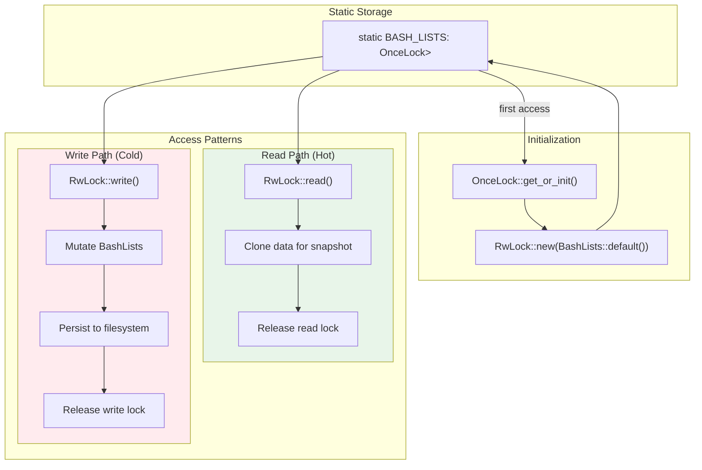

# Global Mutable State in Rust

### From: bash_lists

Global mutable state in Rust requires careful handling due to the language's ownership and thread-safety guarantees, typically addressed through synchronization primitives and lazy initialization patterns. The bash_lists module demonstrates the modern Rust approach using OnceLock for thread-safe, one-time initialization combined with RwLock for interior mutability with shared access. OnceLock, stabilized in Rust 1.70, provides an alternative to the older lazy_static crate with better performance characteristics and standard library integration. The pattern `static BASH_LISTS: OnceLock<RwLock<BashLists>> = OnceLock::new()` defers initialization to first use via the `get_or_init` method, avoiding complex initialization order issues while maintaining const evaluation for the static itself.

The RwLock (read-write lock) choice reflects the module's access patterns: many concurrent readers validating commands against the allowlist/denylist, with relatively infrequent writers modifying configuration. This provides better scalability than a Mutex under read-heavy workloads, though at the cost of potential writer starvation and the complexity of handling lock poisoning. The module's `global()` helper function encapsulates the lock acquisition, presenting a clean API while hiding the synchronization details. Error handling for poisoned locks uses anyhow conversion, treating this edge case (where a panic during write leaves the lock poisoned) as a fatal error for the operation. This pattern is common in server applications and long-running daemons where global configuration caches or registries must be accessible from multiple execution contexts.

## Diagram

## External Resources

- [std::sync::OnceLock - Rust standard library documentation](https://doc.rust-lang.org/std/sync/struct.OnceLock.html) - std::sync::OnceLock - Rust standard library documentation
- [std::sync::RwLock - synchronization primitive documentation](https://doc.rust-lang.org/std/sync/struct.RwLock.html) - std::sync::RwLock - synchronization primitive documentation
- [Blog post on synchronization primitive selection in Rust systems programming](https://matklad.github.io/2020/01/02/spinlocks-considered-harmful.html) - Blog post on synchronization primitive selection in Rust systems programming

## Related

- [Interior Mutability](interior-mutability.md)

## Sources

- [bash_lists](../sources/bash-lists.md)
