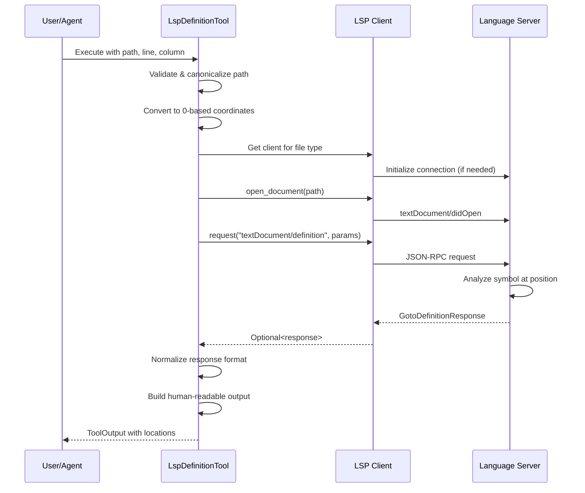

# Goto Definition

### From: lsp_definition

Goto Definition is a fundamental code navigation feature in modern development environments that jumps from a symbol's usage to its declaration or definition site. This feature enables developers to understand code by tracing identifiers to their origins, examining implementation details, and navigating large codebases efficiently. In LSP terminology, this corresponds to the `textDocument/definition` request, which accepts a document URI and position and returns one or more locations where the symbol is defined.

The semantics of "definition" vary by language and context. For variables, it typically means the declaration site. For functions and methods, it means the implementation or declaration. For types, it means the type definition. Languages with complex resolution rules—including inheritance, overloading, partial classes, or multiple implementations—may return multiple locations. The LSP response type `GotoDefinitionResponse` captures this variability as a tagged union: a scalar single location, an array of locations, or an array of location links that include additional metadata. This implementation handles all three variants, normalizing them to a consistent internal representation.

Goto Definition differs from related navigation features: "Find References" locates all usages rather than the definition, "Go to Declaration" finds declarations separate from definitions (relevant in C/C++ header files), and "Go to Type Definition" navigates to the type of a symbol rather than the symbol itself. These distinctions matter for tool builders and user experience design. The implementation here specifically targets definition navigation, appropriate when users want to examine implementation details or understand where a symbol originates. The tool's description explicitly notes it handles overloaded functions by returning all definition locations, setting appropriate user expectations.

## Diagram

## External Resources

- [LSP textDocument/definition specification](https://microsoft.github.io/language-server-protocol/specifications/specification-current/#textDocument_definition) - LSP textDocument/definition specification

## Sources

- [lsp_definition](../sources/lsp-definition.md)
