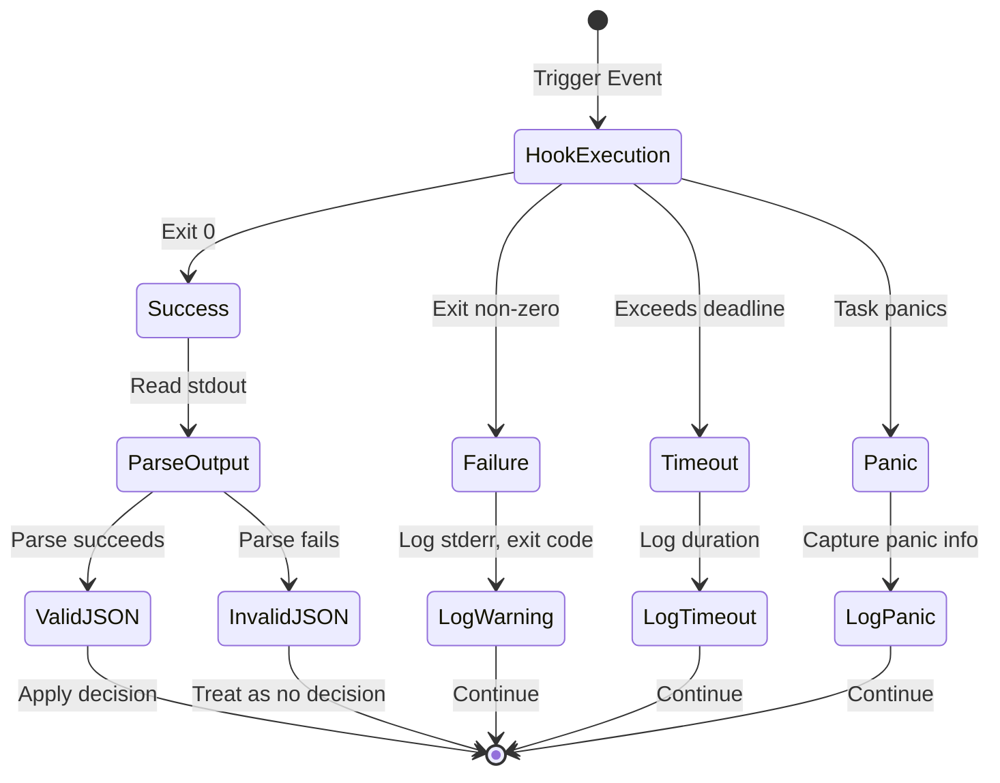

# Graceful Degradation and Error Isolation

### From: mod

A critical design philosophy pervading the hooks implementation is graceful degradation—hook failures must never cascade into session failures. Every hook execution path includes comprehensive error handling: non-zero exit codes trigger warn-level logging with stderr capture, execution failures emit error-level traces with full exception details, timeouts generate specific warnings with duration context, and panics in spawned tasks are caught and logged. This defensive posture recognizes that user-provided hooks are inherently unreliable—they may reference missing commands, contain logic errors, or depend on unavailable resources. The fire_hooks function exemplifies this approach by spawning independent tasks per hook, ensuring one hook's failure cannot stall others or the caller. Return types encode this resilience: PreToolUseResult::NoDecision and Option<serde_json::Value> provide explicit paths for "no opinion" outcomes, while the runtime's default behaviors ensure continuity. This design enables aggressive hook experimentation—users can deploy hooks confidently knowing that mistakes produce logged diagnostics rather than system outages, lowering the barrier to operational customization.

## Diagram

## External Resources

- [Rust error handling patterns and philosophy](https://doc.rust-lang.org/book/ch09-00-error-handling.html) - Rust error handling patterns and philosophy
- [Tracing crate for structured diagnostic logging](https://docs.rs/tracing/latest/tracing/) - Tracing crate for structured diagnostic logging

## Related

- [Defensive Programming](defensive-programming.md)

## Sources

- [mod](../sources/mod.md)
