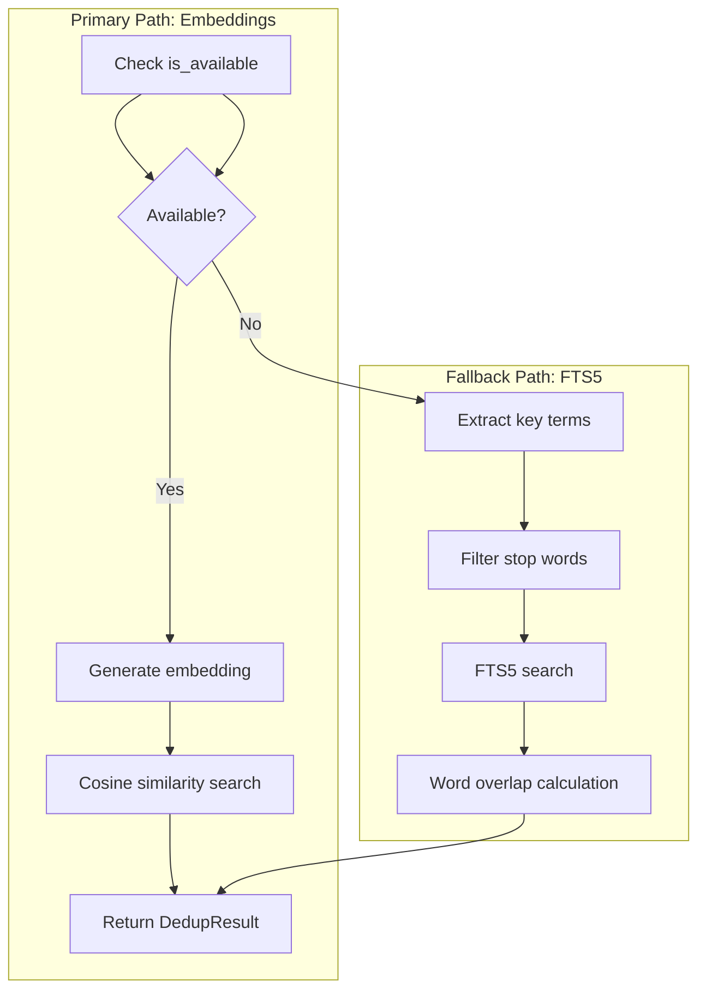

# Graceful Degradation in AI Systems

### From: compact

Graceful degradation is a resilient system design principle where primary functionality remains available through alternative mechanisms when optimal resources become unavailable, rather than failing entirely. The ragent deduplication subsystem exemplifies this through its embedding-to-FTS5 fallback chain: when vector embedding services are inaccessible, due to network failure, cost constraints, or local deployment without GPU resources, the system transparently switches to keyword-based similarity detection. This architectural pattern recognizes that imperfect deduplication generally surpasses complete deduplication failure, maintaining data hygiene without hard dependencies on external services. The implementation checks embedding availability through an is_available predicate rather than catching failures, enabling proactive fallback before resource expenditure and providing clearer operational signals.

The engineering implications extend beyond the immediate fallback to encompass configuration-driven behavior, comprehensive logging, and state machine design. Warning-level logging for embedding failures supports operational monitoring without log spam, while the identical DedupResult return type across both strategies ensures caller transparency to the implementation detail. This abstraction prevents decision logic fragmentation across the codebase, centralizing strategy selection within the deduplication module. Similar patterns appear throughout the compaction system: the trigger-based execution allows scheduled maintenance when real-time compaction would impact latency-sensitive operations, and journal logging enables recovery from compaction errors that might otherwise cause data loss. These compound resilience strategies characterize mature production systems that anticipate partial failures as normal operating conditions rather than exceptional states requiring human intervention.

## Diagram

## External Resources

- [AWS architecture blog on resilient system design patterns](https://aws.amazon.com/blogs/architecture/designing-resilient-systems/) - AWS architecture blog on resilient system design patterns
- [Google SRE Book: Handling overload and graceful degradation](https://sre.google/sre-book/handling-overload/) - Google SRE Book: Handling overload and graceful degradation

## Related

- [defensive programming](defensive-programming.md)

## Sources

- [compact](../sources/compact.md)
