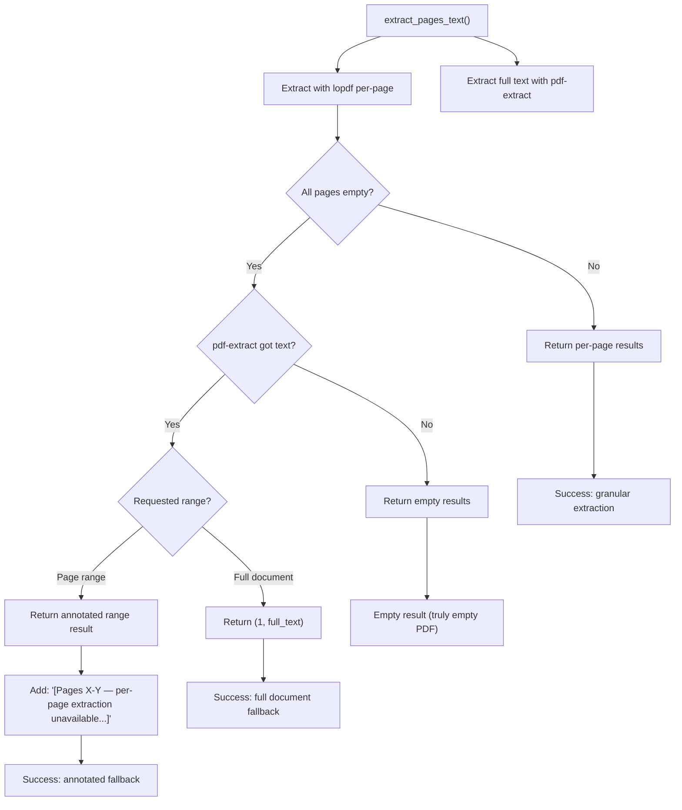

# Graceful Degradation in Document Processing

### From: pdf_read

Graceful degradation in document processing refers to the architectural approach of designing systems that maintain partial functionality when ideal processing paths fail, exemplified in this implementation through its sophisticated fallback mechanisms for PDF text extraction. The code implements a two-tier extraction strategy where primary per-page extraction via lopdf is validated against a secondary full-document extraction via pdf-extract, with automatic fallback when the primary approach yields unsatisfactory results. This pattern recognizes the fundamental reality of document processing: PDF is a complex, variably-implemented format where documents from different sources and generations may use features that complicate or break particular extraction approaches.

The implementation's degradation logic reveals deep understanding of PDF diversity. After attempting lopdf-based per-page extraction, it checks `all_empty`—whether every page returned empty or whitespace-only content—and compares against `full_text.trim().is_empty()` from pdf-extract. This comparison serves as a quality signal: if the specialized per-page approach fails while the comprehensive approach succeeds, the document likely uses PDF features (certain font encodings, XFA forms, image-based text with invisible structure) that defeat the primary method. The fallback then adapts its output format based on the requested page range, either returning full document text attributed to page 1 for complete document requests, or annotating the output to indicate the range limitation when partial extraction was requested.

This approach carries important implications for agent system reliability. Rather than failing completely when encountering unexpected PDF structures, the tool preserves access to document content with degraded granularity. For agents processing arbitrary documents from external sources—where document quality and standards compliance vary enormously—this resilience prevents cascade failures where one unreadable document stalls an entire workflow. The annotation in fallback cases ('[Pages {start}-{end} — per-page extraction unavailable, showing full document text]') maintains transparency about quality degradation, enabling downstream components or human operators to make informed decisions about result reliability. This pattern of validated primary extraction with annotated fallback represents best practice for production document processing where completeness often matters more than optimal formatting.

## Diagram

## External Resources

- [PDF Association specifications - understanding PDF format complexity and variants](https://www.pdfta.org/pdf-specifications/) - PDF Association specifications - understanding PDF format complexity and variants

## Sources

- [pdf_read](../sources/pdf-read.md)
