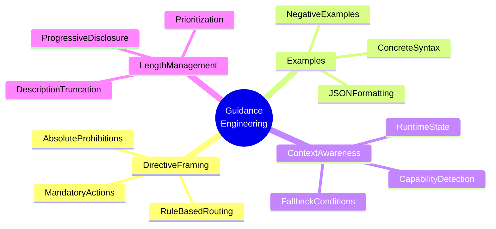

# Guidance Engineering for LLM Tool Use

### From: processor

Guidance engineering refers to the systematic design of system prompts that constrain and direct language model behavior toward reliable tool invocation patterns. The `SessionProcessor` implements this through multiple specialized guidance sections (`build_lsp_guidance_section`, `build_codeindex_guidance_section_active`, `build_codeindex_guidance_section_disabled`, `build_tool_reference_section`) that collectively address the fundamental challenge of preventing tool hallucination and misselection.

The codebase demonstrates several evidence-based guidance techniques: absolute prohibitions using "Do NOT" framing to eliminate edge cases, concrete examples with exact JSON syntax rather than abstract descriptions, decision flowcharts that replace implicit reasoning with explicit routing rules, and negative space definition (clarifying when NOT to use tools) to sharpen discrimination boundaries. The LSP guidance exemplifies this with its mandatory directive: "For source files in these languages, you MUST use LSP tools instead of `grep`/`glob`" followed by specific capability mapping.

The codebase index guidance extends this to a complete decision framework with six specific routing rules and explicit fallback conditions. This structured approach contrasts with simpler tool lists by encoding operational logic directly into the prompt. The active/disabled state distinction for codeindex shows environmental awareness—guidance adapts to runtime capabilities rather than static assumptions. The tool reference section's truncation logic (limiting descriptions to 120 characters) demonstrates prompt length management, trading comprehensiveness for attention preservation in long context windows.

## Diagram

## External Resources

- [Take a Step Back: Evoking Reasoning via Abstraction in Large Language Models](https://arxiv.org/abs/2309.03409) - Take a Step Back: Evoking Reasoning via Abstraction in Large Language Models
- [OpenAI function calling best practices](https://platform.openai.com/docs/guides/function-calling) - OpenAI function calling best practices

## Sources

- [processor](../sources/processor.md)
