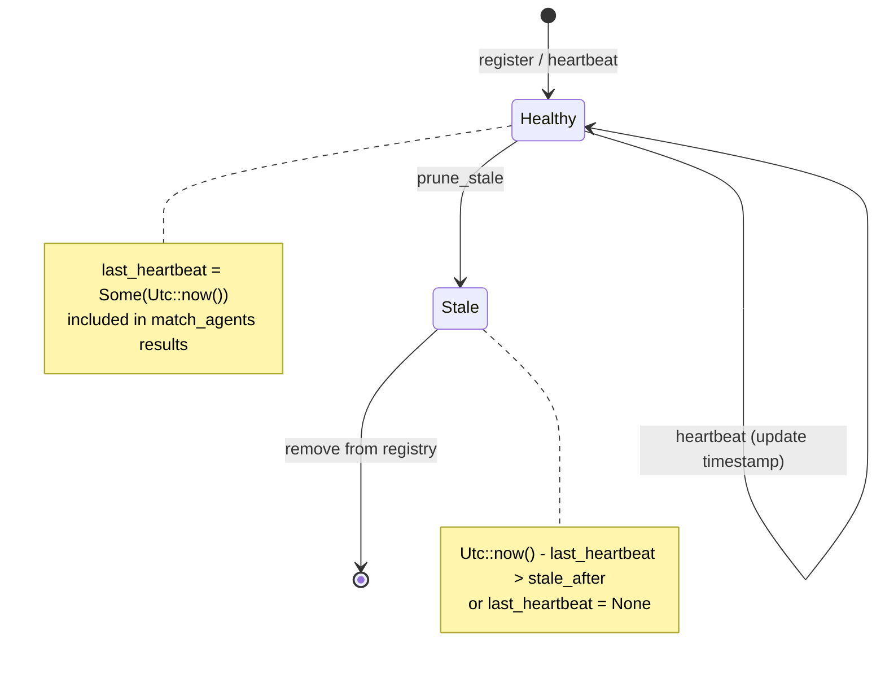

# Heartbeat-Based Health Monitoring

### From: registry

Heartbeat-based health monitoring is a fault-tolerance pattern where components periodically signal liveness, enabling failure detectors to identify and remove unresponsive entities. This implementation provides explicit heartbeat registration through the heartbeat method and automatic stale agent pruning via prune_stale, creating a self-healing registry that maintains accurate membership information despite process crashes, network partitions, or graceful shutdown failures.

The design reveals important distributed systems trade-offs. Heartbeat timestamps use chrono::DateTime<Utc> for timezone-safe comparison, with staleness computed against configurable std::time::Duration parameters. The conversion to chrono::Duration with fallback to 60 seconds demonstrates defensive programming—unwrap_or prevents panic on conversion edge cases while providing sensible defaults. The prune operation's two-phase collection-then-removal pattern avoids iterator invalidation during HashMap modification, though it temporarily allocates a vector of keys.

Failure detection sensitivity is directly tunable through the stale_after parameter, allowing operators to balance between rapid failure detection and tolerance for transient delays. This is crucial in async Rust where tasks may legitimately pause during .await points. The optional last_heartbeat field (Option<DateTime<Utc>>) accommodates agents that register without immediate heartbeat, though prune_stale conservatively treats None as stale to prevent immortal ghost entries.

The pattern's limitations in this implementation include lack of gossip-style propagation for distributed registries—heartbeats are local to each registry instance—and no automatic heartbeat generation, requiring agents or external systems to explicitly call heartbeat(). Production extensions might include heartbeat timeouts with escalation, suspect-state intermediate detection, or integration with distributed consensus for partition tolerance. The combination with capability matching creates interesting dynamics where stale agent removal immediately affects workload routing, potentially triggering cascading reassignments in dependent systems.

## Diagram

## External Resources

- [Google SRE Book: Monitoring Distributed Systems](https://sre.google/sre-book/monitoring-distributed-systems/) - Google SRE Book: Monitoring Distributed Systems
- [SWIM: Scalable Weakly-consistent Infection-style Process Group Membership Protocol](https://www.cs.cornell.edu/projects/Quicksilver/public_pdfs/SWIM.pdf) - SWIM: Scalable Weakly-consistent Infection-style Process Group Membership Protocol

## Sources

- [registry](../sources/registry.md)
