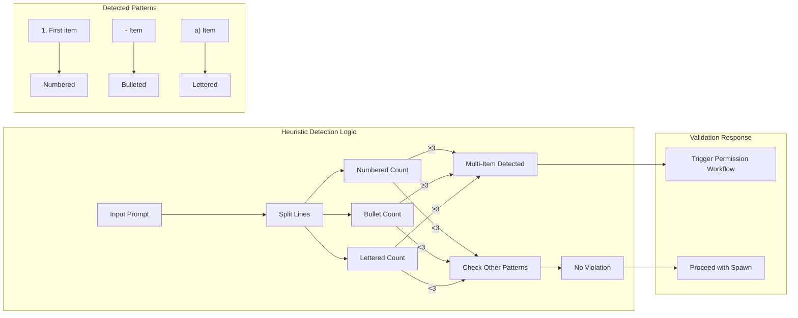

# Heuristic Input Validation

### From: team_spawn

Heuristic input validation in `TeamSpawnTool` exemplifies practical pattern recognition for enforcing semantic constraints that resist formal schema specification. The `detect_multi_item_list` function implements structural analysis of natural language prompts to identify violations of the single-work-item policy, using line-oriented parsing to recognize enumerated list patterns. This approach addresses the fundamental challenge that JSON Schema and similar structural validation cannot express constraints on the semantic content of string fields—distinguishing acceptable prose from problematic enumerations requires domain-specific interpretation.

The heuristic's evolution documented in code comments—specifically the exclusion of simple connective words like "and" or "or"—reveals empirical refinement against false positive patterns encountered in production. The current implementation requires strong structural evidence: three or more items in numbered (digit-dot-space), bulleted (hyphen-space or asterisk-space), or lettered (lowercase-letter-parenthesis-space) formats. This threshold-based approach with explicit counting distinguishes deliberate lists from incidental enumeration, reducing user friction while maintaining policy effectiveness. The regex-avoidant implementation using direct byte inspection suggests performance consciousness and perhaps prior experience with regex performance pitfalls in hot paths.

The validation pattern extends beyond detection to appropriate response escalation. Rather than hard rejection, multi-item detection triggers permission workflow—elevating to human judgment rather than automated enforcement. This tiered response (heuristic detection → human escalation → explicit override) represents sophisticated policy implementation that balances automation efficiency with recognition of heuristic limitations. The comprehensive context provided in permission descriptions—including the specific rule violated and clear alternative ("Split into separate team_spawn calls")—supports informed user decision-making. Together these patterns demonstrate mature applied machine learning operations where input validation serves not merely as gatekeeping but as intelligent assistance guiding users toward effective system interaction.

## Diagram

## External Resources

- [JSON Schema specification for structural validation limits](https://json-schema.org/understanding-json-schema/) - JSON Schema specification for structural validation limits
- [Heuristic evaluation principles in interface design](https://en.wikipedia.org/wiki/Heuristic_evaluation) - Heuristic evaluation principles in interface design

## Related

- [Context Window Management](context-window-management.md)
- [Permission-Based Workflows](permission-based-workflows.md)

## Sources

- [team_spawn](../sources/team-spawn.md)
