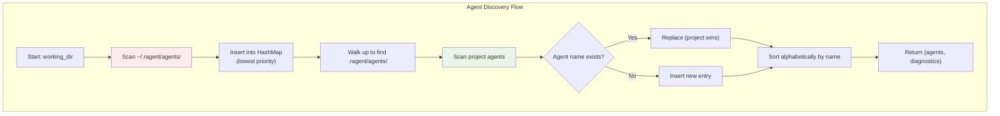

# Hierarchical Agent Discovery

### From: custom

Hierarchical agent discovery is a configuration loading pattern that implements priority-based resolution across multiple configuration scopes, specifically user-global and project-local directories. This concept draws from established patterns in tools like Git (`.git/config` vs `~/.gitconfig`), Docker (Dockerfile vs daemon.json), and Python virtual environments. In ragent's implementation, the discovery process walks the directory hierarchy from the working directory upward to locate `.ragent/` markers, enabling repository-specific agent definitions that override personal defaults. This supports team collaboration: project-specific agents can be version-controlled and shared, while individual developers maintain their preferred tools and shortcuts in their home directory. The override semantics are strict—project-local definitions completely replace global ones with matching names—avoiding confusing merge semantics. The implementation uses recursive directory scanning with HashMap-based deduplication, collecting all agents before final sorting for stable output ordering. Error isolation ensures that malformed project-local files don't prevent global agents from loading, supporting incremental migration and experimentation.

## Diagram

## External Resources

- [Git configuration file precedence documentation](https://git-scm.com/docs/git-config#_configuration_file) - Git configuration file precedence documentation
- [Twelve-Factor App methodology on configuration management](https://12factor.net/config) - Twelve-Factor App methodology on configuration management

## Sources

- [custom](../sources/custom.md)
